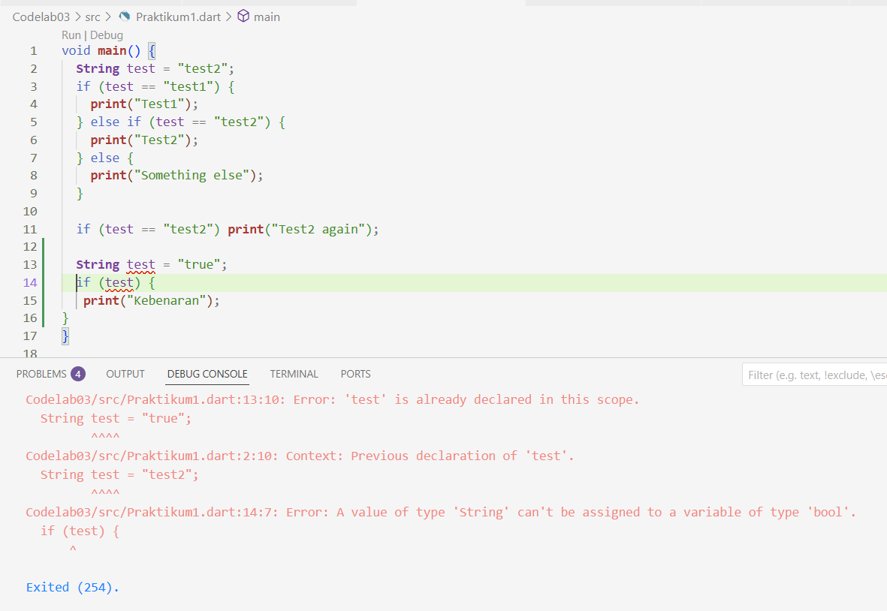
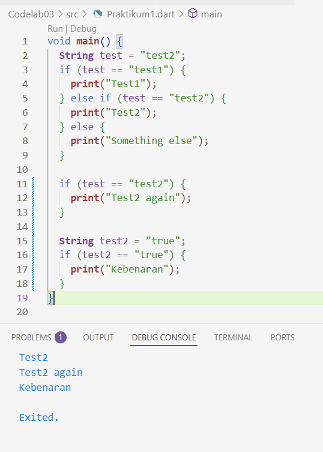
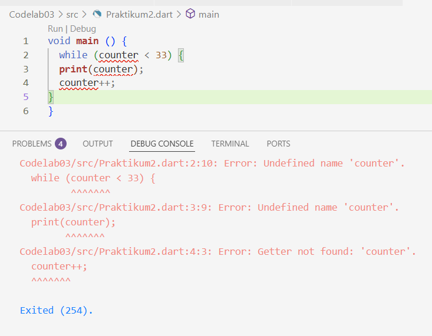
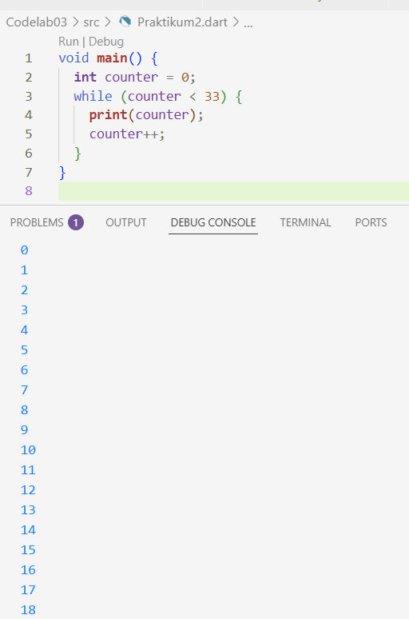
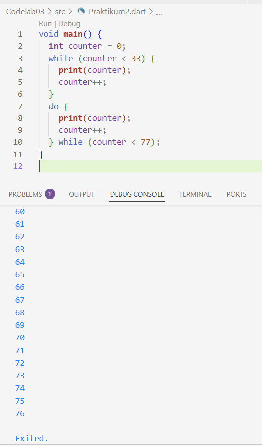
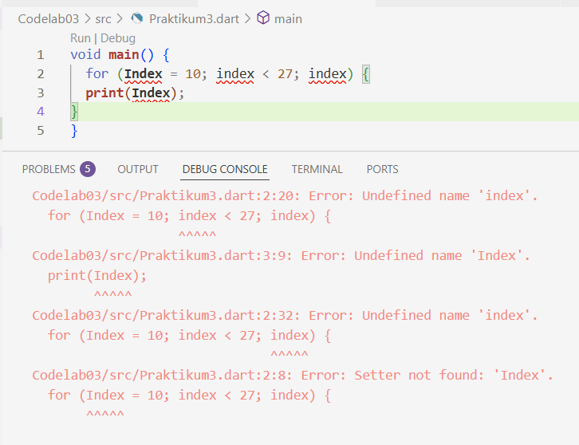
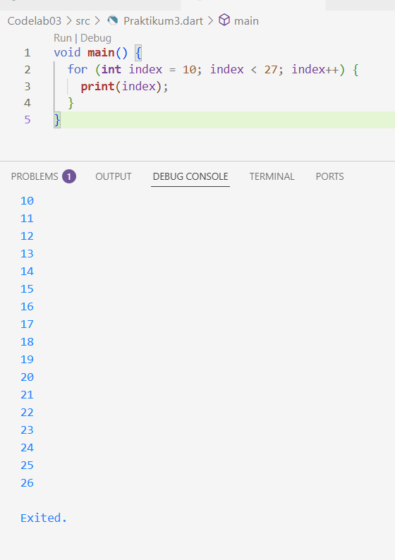
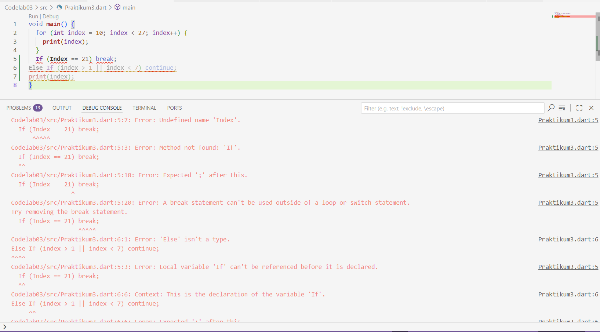
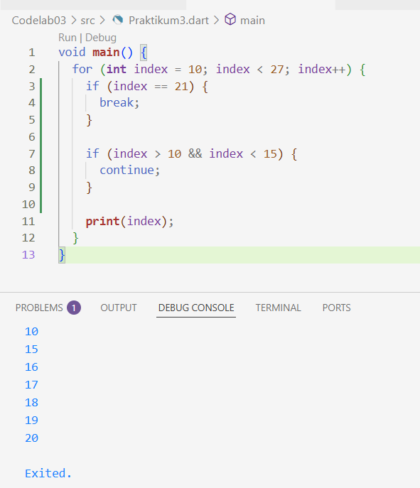
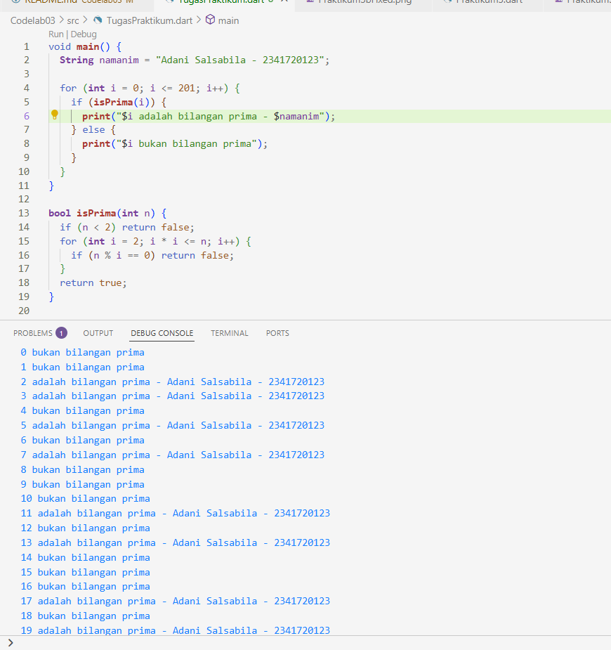

# PRAKTIKUM 1

  
Kode program pada Langkah 1, ketika diketikkan, akan menghasilkan error karena ada kesalahan kapitalisasi di else if.

Setelah diperbaiki:

Menambahkan kode:

  
Kode program yang ditambahkan ini akan memunculkan error, karena mendeklarasikan variabel test dua kali dalam fungsi yang sama (main). Pertama, sebagai `String test = "test2";`. Kedua, sebagai `String test = "true";`.

Setelah diperbaiki:

# PRAKTIKUM 2

  
Pada kode tersebut, terjadi error karena variabel counter belum dideklarasikan.

Setelah diperbaiki:

Menambahkan kode:

  
Tidak ada error yang terjadi dan semua kode berjalan dengan baik. Output angka dari 0 hingga 32 dari loop while dan angka dari 33 hingga 76 dari loop do-while. 

# PRAKTIKUM 3

  
Terjadi error karena variabel belum dideklarasikan, sintaks loop tidak lengkap, dan kesalahan penulisan.

Setelah diperbaiki :  
  

Menambahkan kode:  

  
Terjadi error karena variabel index belum dideklarasikan dengan tipe data dan nilai awal, sintaks for loop tidak lengkap karena tidak ada bagian increment atau decrement, dan kode tersebut memiliki kesalahan penulisan case-sensitive.

Setelh diperbaiki:  
  

# TUGAS PRAKTIKUM

  
