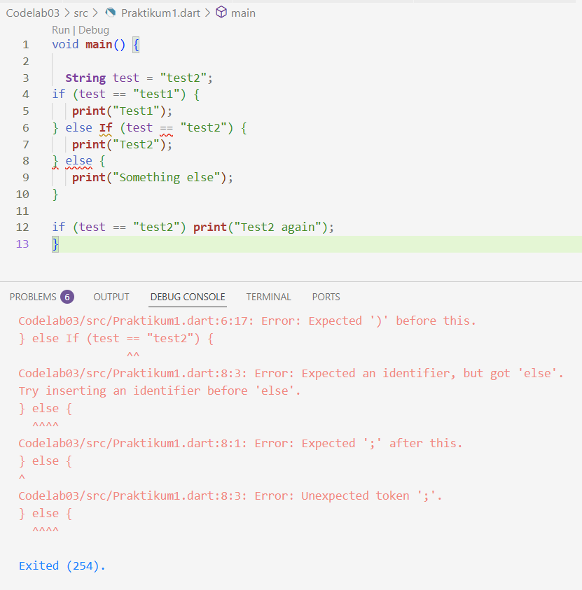

# PRAKTIKUM 1

Kode program pada Langkah 1, ketika diketikkan, akan menghasilkan error karena ada kesalahan kapitalisasi di else if.

Setelah diperbaiki :

Menambahkan kode 

Kode progrm yang ditambahkan ini akan memunculkan eror, karena pendeklarasikan variabel test dua kali dalam fungsi yang sama (main). Pertama, sebagai String test = "test2";. Kedua, sebagai string test = "true";.

Setelah diperbaiki : 

