# Codelab 04

Praktikum 1: Eksperimen Tipe Data List

langkah 1 dan 2 : tidak ada error, output sesuai. 
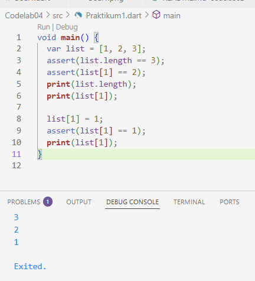  

langkah 3 : menambahkan kode dan memasukkan nama dan nim ke dalam kode.
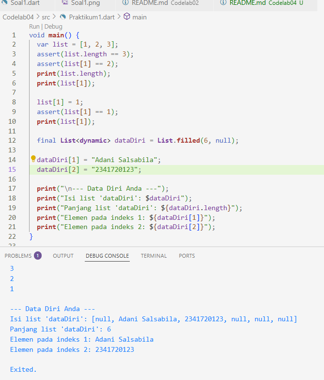  

Praktikum 2: Eksperimen Tipe Data Set

langkah 1 : tidak ada error, output sesuai dan mencetak semua elemen yang ada di dalam variabel halogens.
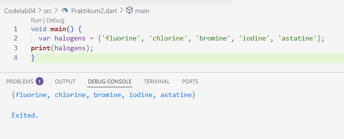  

langkah 2 : tidak ada error.
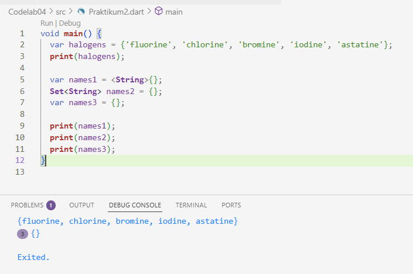  

menambahkan nama dan NIM ke names1 (menggunakan .add()) dan names2 (menggunakan .addAll()), dan hapus variabel Map (names3)
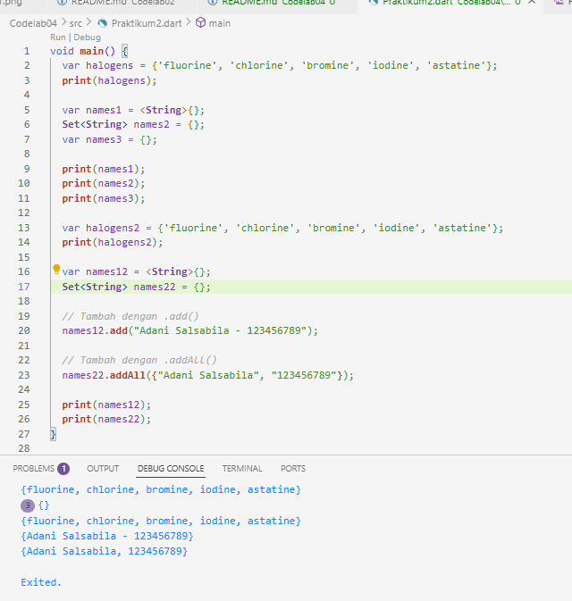  

Praktikum 3 : Eksperimen Tipe Data Maps

langkah 1 dan 2 : kedua variabel, gifts dan nobleGases, dideklarasikan sebagai Map. Map adalah koleksi data yang menyimpan pasangan key-value
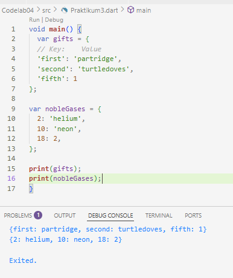  

langkah 3 : awalnya ada error, untuk menghilangkan error dan membuat kode berjalan dengan tipe yang konsisten (seperti Map<String, String> dan Map<int, String>), kita harus menggunakan variabel baru (mhs1, mhs2) atau mendeklarasikan ulang tipe gifts dan nobleGases
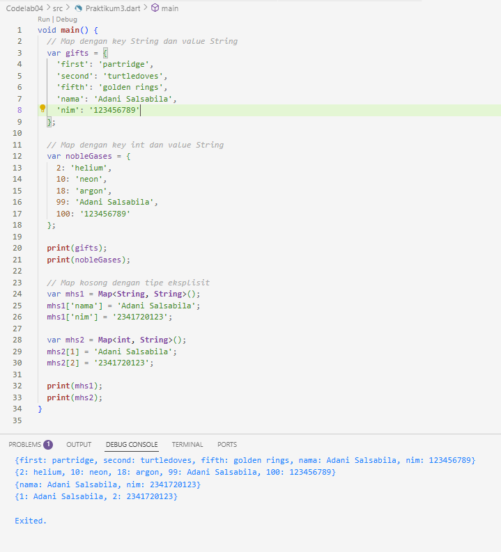  

Praktikum 4: Eksperimen Tipe Data List: Spread dan Control-flow Operators

langkah 1 dan 2 : Terjadi Error. Variabel list1 pada baris print(list1); tidak pernah dideklarasikan. Anda mungkin bermaksud mencetak list.
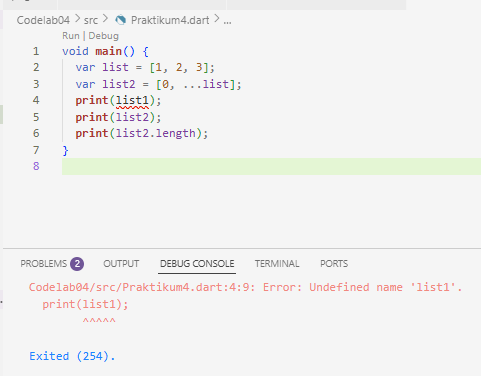  

perbaikan: Ganti print(list1); menjadi print(list)
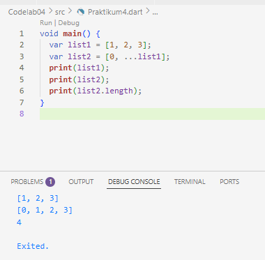  

langkah 3 : Terjadi Error karena list1 tidak didefinisikan. Asumsi perbaikan dari Langkah 2 adalah mengganti list1 dengan list.
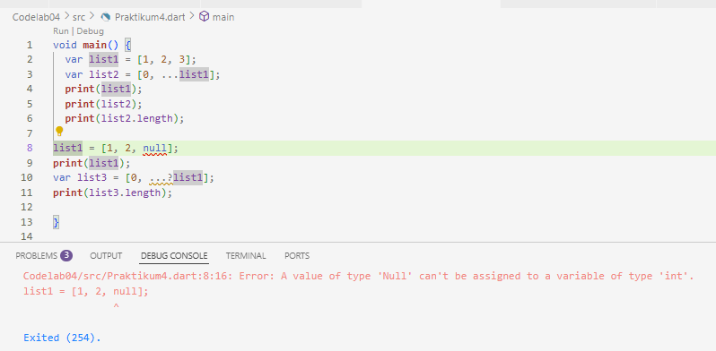  

Perbaikan: Ganti list1 menjadi list
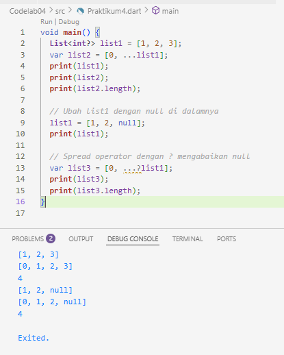  

menambahkan nim
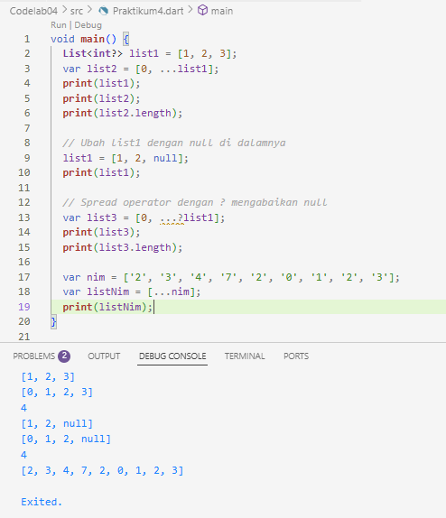  

langkah 4 : ada error
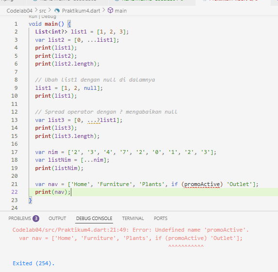  

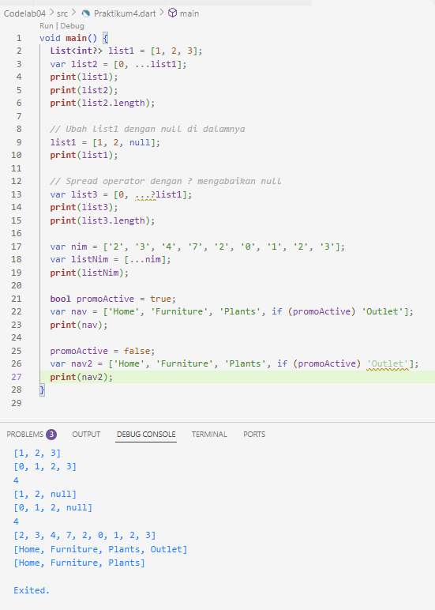  

langlah 5 : ada error
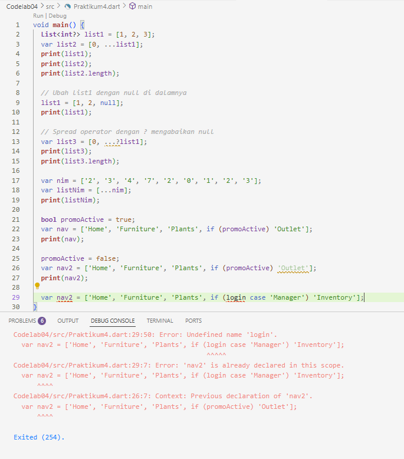  

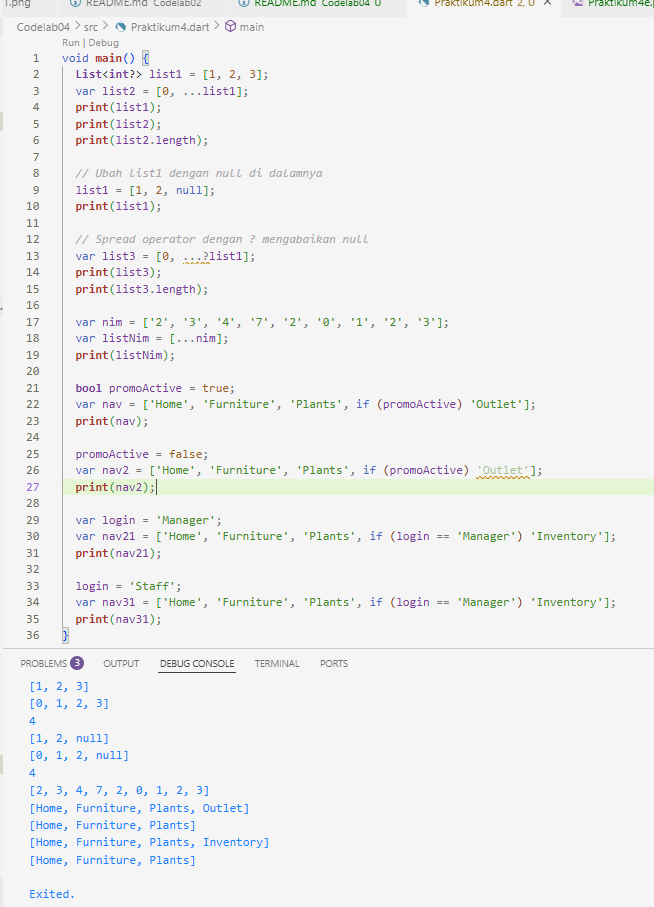  

langkah 6 : 
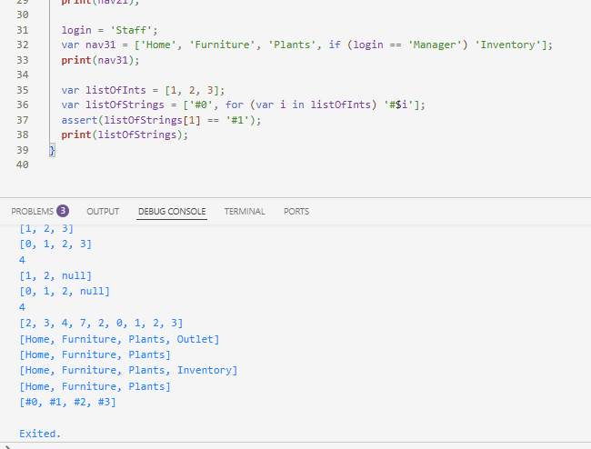  

Praktikum 5: Eksperimen Tipe Data Records

langkah 1 dan 2 : tidak ada error, berhasil mencetak representasi string dari Record tersebut, termasuk nama field yang diberi nama.
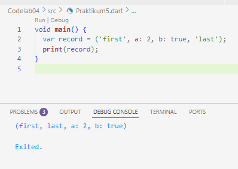  

langkah 3 : tidak ada error, (10, 20) diteruskan ke swap. Di dalamnya, a menjadi 10 dan b menjadi 20. Fungsi mengembalikan Record baru (20, 10)
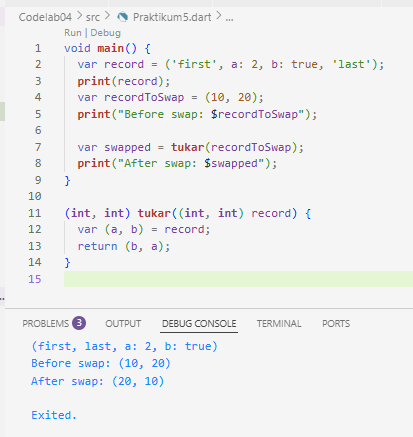  

langkah 4 : ada error karena mahasiswa belum dideklarasikan.
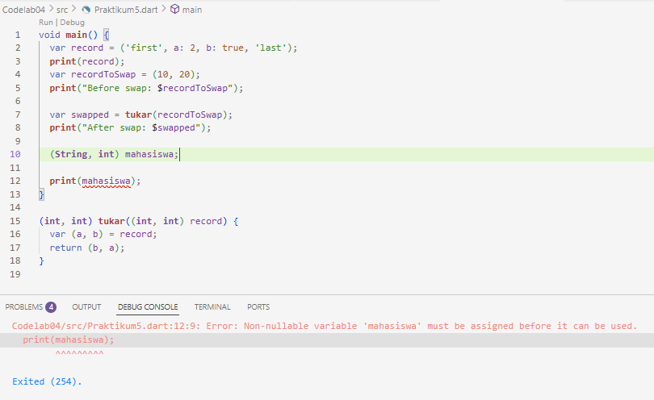  

perbaikan : diisi dengan nim dan mana
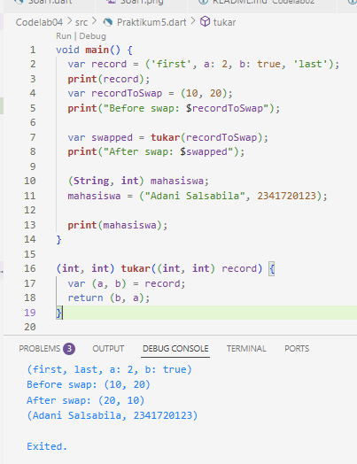  

langkah 5 : tidak ada error.
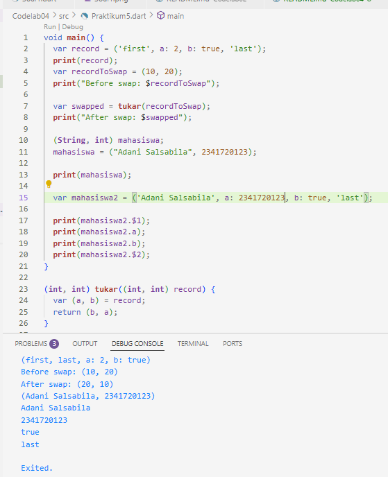  

Tugas Praktikum

a. Jelaskan yang dimaksud Functions dalam bahasa Dart!  
jawab : Functions (Fungsi) dalam bahasa Dart adalah blok kode yang terorganisir dan dapat digunakan kembali untuk melakukan satu tugas tertentu.

b. Jelaskan jenis-jenis parameter di Functions beserta contoh sintaksnya! 
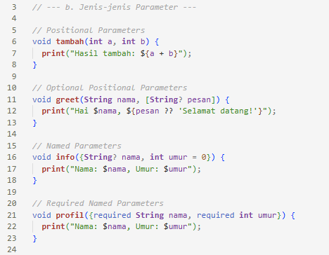  
jawab : jenis-jenis parameter di functions adalah : Positional Parameters (Wajib urutan), Optional Positional Parameters (Boleh dikosongkan, pakai []), Named Parameters (Menggunakan {}), dan Required Named Parameters (pakai required).

c. Jelaskan maksud Functions sebagai first-class objects beserta contoh sintaknya!  
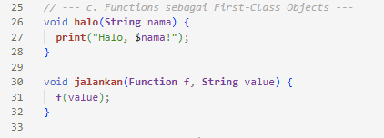  
jawab : Di Dart, fungsi adalah first-class objects, artinya fungsi diperlakukan seperti data/objek lain. Bisa disimpan ke variabel, dikirim sebagai argumen, atau dikembalikan dari fungsi lain.

d. Apa itu Anonymous Functions? Jelaskan dan berikan contohnya!  
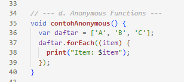  
jawab : Anonymous Function (fungsi tanpa nama) adalah fungsi yang didefinisikan langsung tanpa memberi nama, biasanya dipakai sekali atau sebagai argumen.

e. Jelaskan perbedaan Lexical scope dan Lexical closures! Berikan contohnya!  
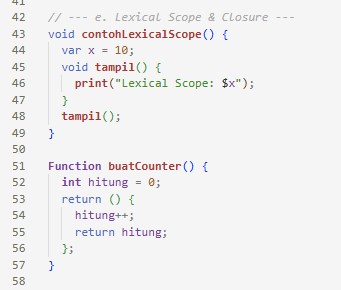  
jawab : Lexical Scope: Variabel dalam fungsi hanya bisa diakses dalam blok di mana variabel itu dideklarasikan, sedangkan :exical Closure: Fungsi bisa "mengingat" variabel dari scope di luar dirinya, meskipun scope itu sudah selesai dieksekusi.

f. Jelaskan dengan contoh cara membuat return multiple value di Functions!  
jawab : Dart tidak mendukung return banyak nilai secara langsung, tapi bisa pakai:
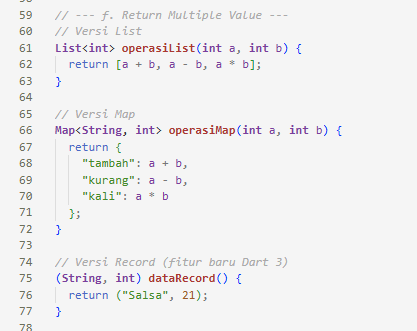  