# Praktikum 1 : Membuat Project Flutter Baru

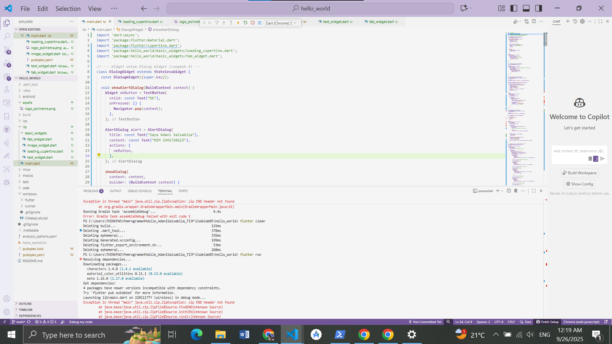   

# Praktikum 2 : Menghubungkan Perangkat Android atau Emulator

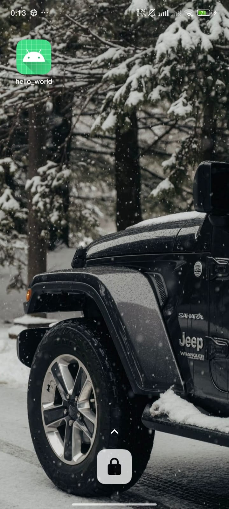   

   

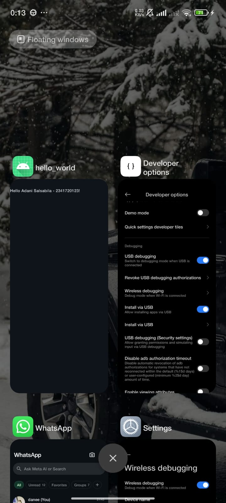   

# Praktikum 3 : Membuat Repository GitHub dan Laporan Praktikum

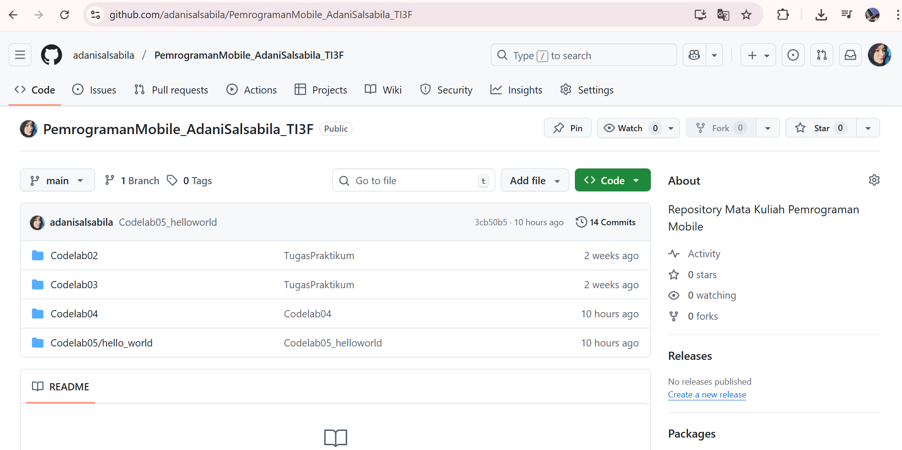   

# Praktikum 4 : Menerapkan Widget Dasar

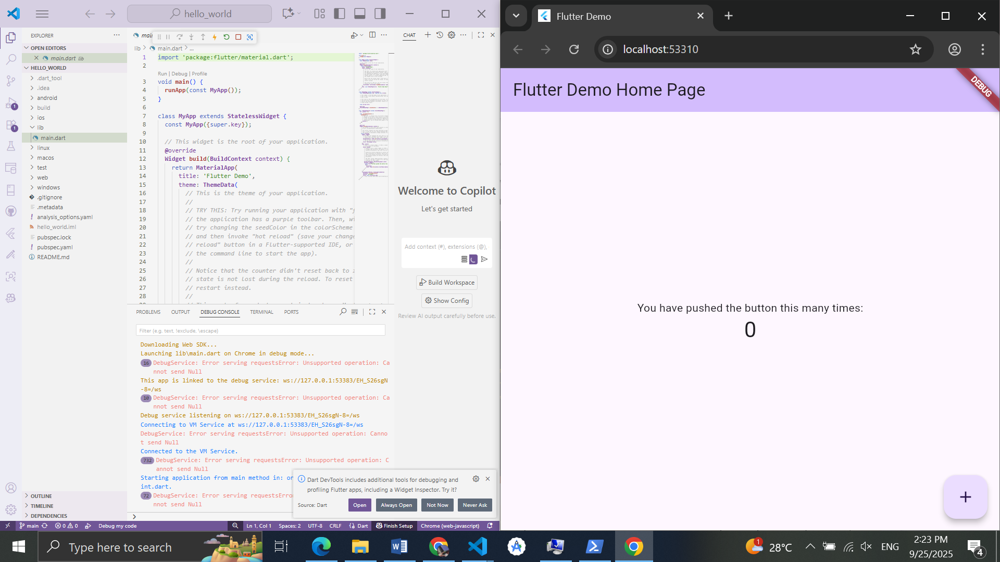   

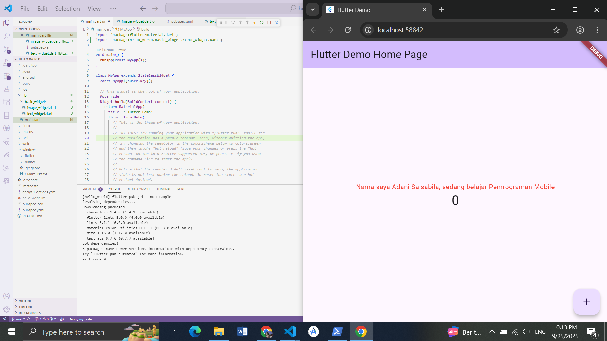   

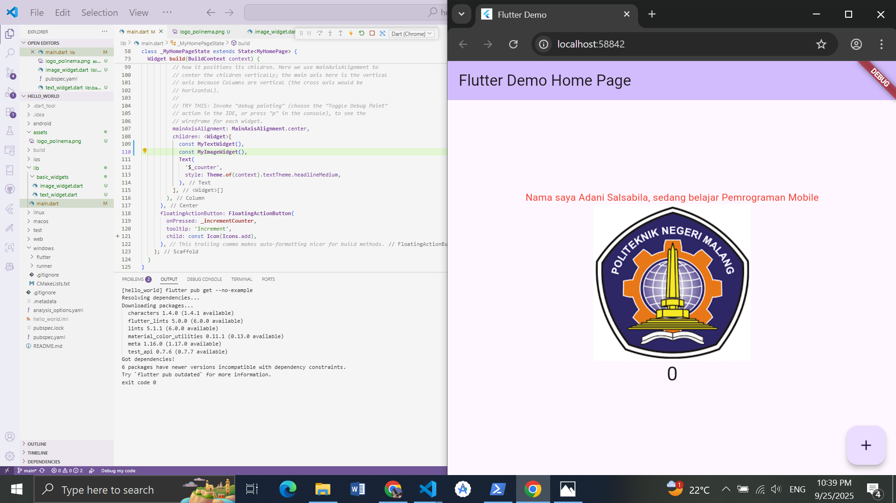   

# Praktikum 5 : Menerapkan Widget Material Design dan iOS Cupertino

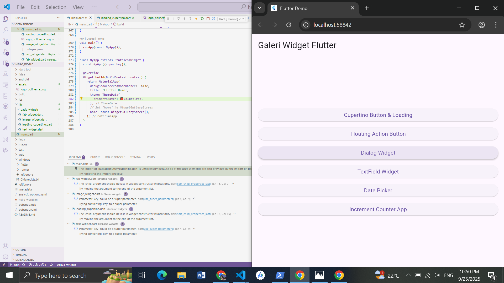   

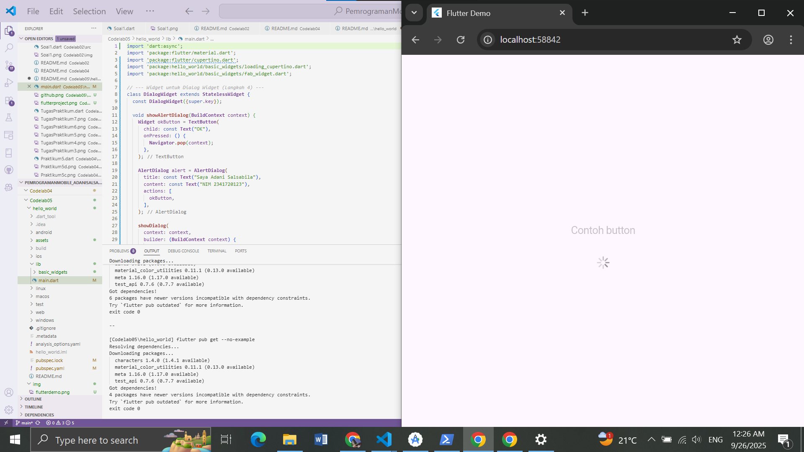   

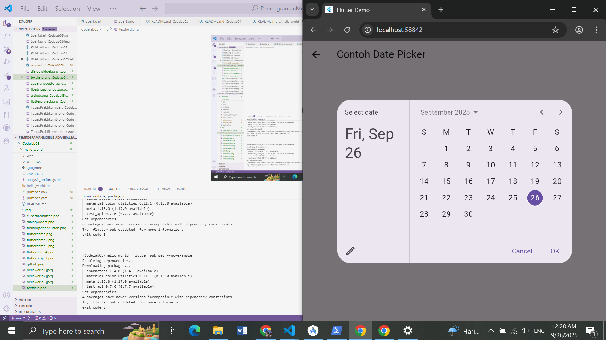   

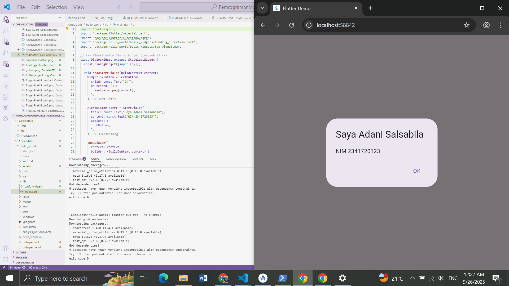   

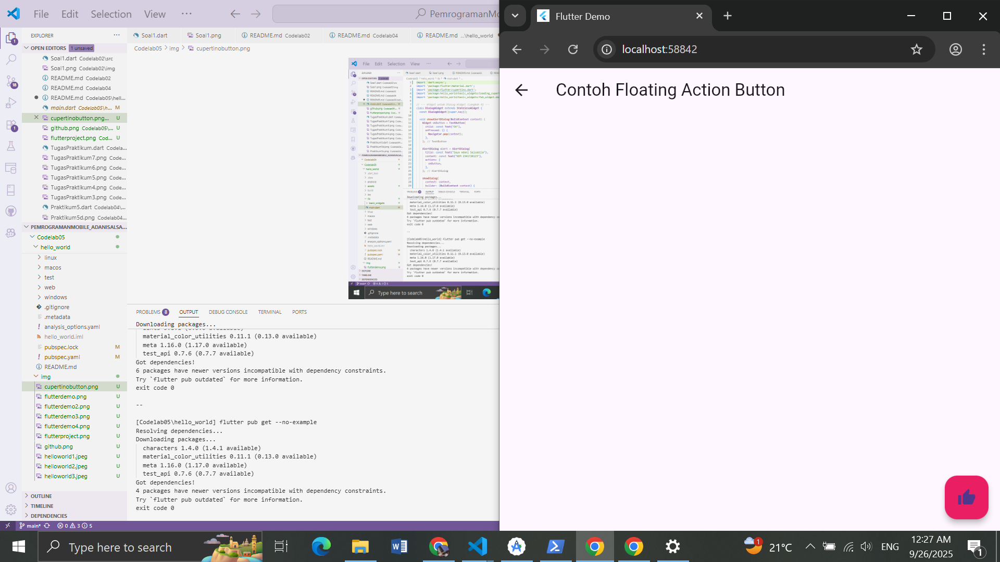   

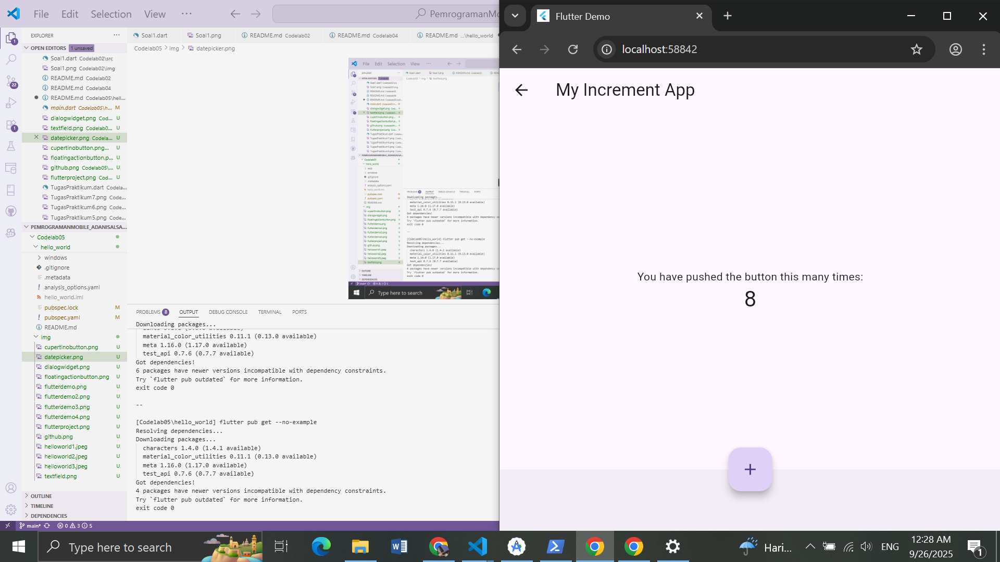   

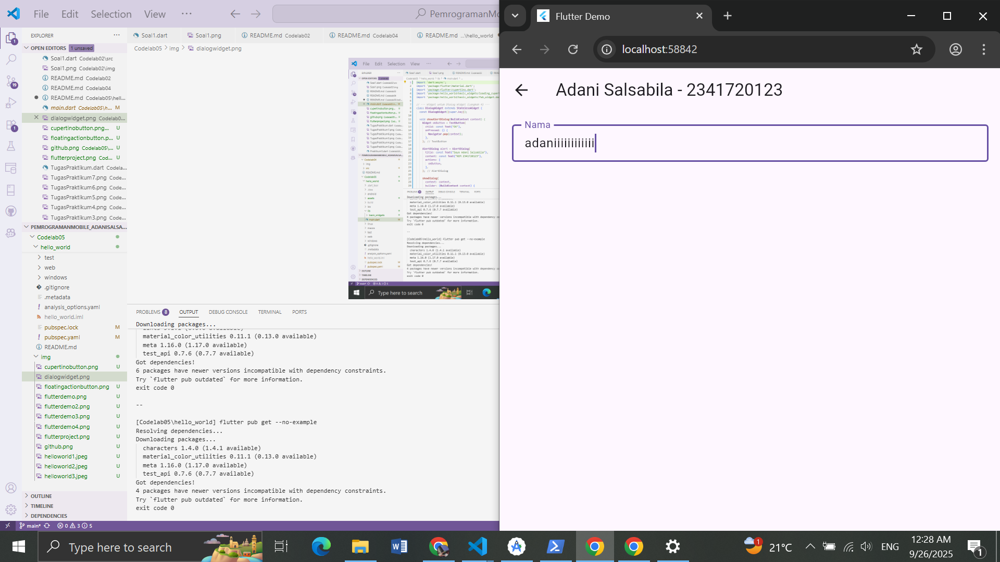   

# Tugas Praktikum : Selesaikan Codelabs: Your first Flutter app

