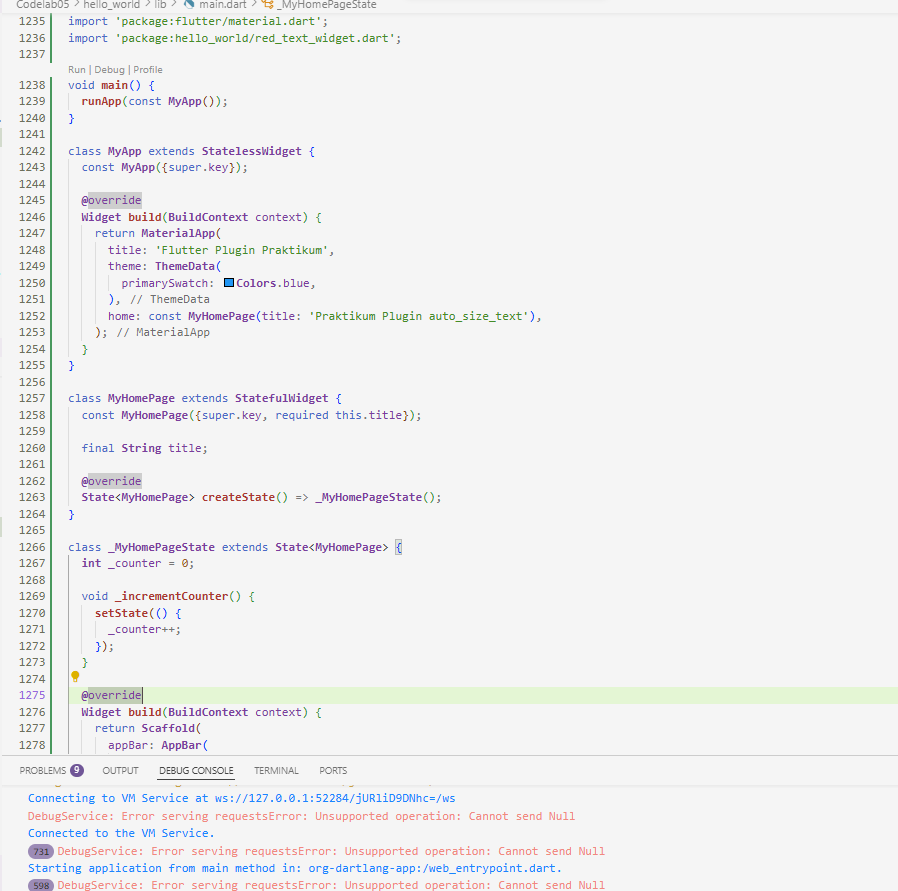
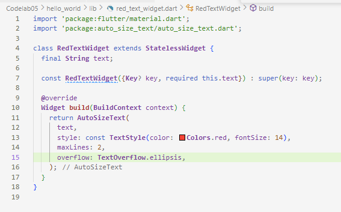

# Codelab07

# Praktikum Menerapkan Plugin di Project Flutter  

1. Penjelasan Langkah 2: Menambahkan Plugin (flutter pub add auto_size_text)  
Langkah 2 bertujuan untuk mengintegrasikan pustaka eksternal (auto_size_text) ke dalam proyek Flutter. Ketika menjalankan perintah flutter pub add auto_size_text di terminal, Flutter secara otomatis mendapatkan versi terbaru dari plugin tersebut dari Pub.dev, menuliskan nama plugin dan versinya ke dalam file pubspec.yaml di bawah bagian dependencies dan menjalankan proses flutter pub get di belakang layar, yang mengunduh paket tersebut dan membuatnya tersedia untuk di-import dan digunakan oleh kode Dart.

2. Penjelasan Langkah 5: Membuat Variabel text dan Parameter  
Langkah 5, yaitu menambahkan final String text; dan required this.text pada constructor RedTextWidget, memiliki dua maksud utama, yaitu mendefinisikan Data yang Dibutuhkan: Variabel final String text mendefinisikan bahwa widget RedTextWidget membutuhkan satu data berupa teks (string) untuk ditampilkan. Karena ini adalah StatelessWidget dan dideklarasikan sebagai final, nilai teks tersebut tidak akan berubah selama masa hidup widget, dan mewajibkan Input (Dependency Injection): Kata kunci required dalam constructor memastikan bahwa setiap kali RedTextWidget dipanggil (seperti di main.dart), pemanggil harus menyediakan nilai untuk parameter text. Tanpa langkah ini, RedTextWidget tidak akan tahu teks apa yang harus ditampilkan di dalam AutoSizeText, dan compiler akan menghasilkan error karena variabel text tidak terdefinisi.

3. Penjelasan Dua Widget pada Langkah 6  
Langkah 6 menambahkan dua container ke dalam lib/main.dart untuk tujuan perbandingan (demonstrasi fungsionalitas plugin):

Container Kuning menggunakan RedTextWidget yang memanfaatkan plugin AutoSizeText. Karena lebar container diatur sangat sempit (50 piksel), AutoSizeText menunjukkan kinerja adaptif: ia akan secara otomatis mengecilkan ukuran font teks dari 14 hingga batas minimum agar seluruh teks dapat dimuat dalam batas 2 baris yang ditentukan. Sebaliknya, Container Hijau menggunakan widget Text standar Flutter. Karena widget Text tidak memiliki kemampuan untuk mengubah ukuran font secara dinamis, meskipun lebar container diatur 100 piksel, teks yang panjang akan terpotong dan diakhiri dengan simbol elipsis (...) tanpa mengurangi ukuran font aslinya. Perbedaan ini secara jelas mendemonstrasikan manfaat utama dari plugin auto_size_text dalam mengelola tata letak yang terbatas.

4. Penjelasan Parameter Plugin auto_size_text  

Inti dari parameter auto_size_text adalah untuk mengontrol penyesuaian ukuran font secara otomatis. Batasan utama penyesuaian ini diatur oleh maxLines, yang memaksa widget mengecilkan font hingga teks muat dalam jumlah baris yang ditentukan. Batas ukuran font ditentukan oleh minFontSize dan maxFontSize (dengan stepGranularity mengatur langkah pengecilan), atau bisa menggunakan daftar ukuran tetap melalui presetFontSizes. Jika teks tetap meluap setelah dikecilkan dapat menggunakan overflow untuk menampilkan elipsis (...) atau overflowReplacement untuk menggantinya dengan widget lain.

5. Hasil Praktikum   

file kode main.dart ada di folder codelab05 karena saya memakai project hello_world untuk praktikum ini    
  

file kode red_text_widget.dart juga berada di folder codelab05 karena saya memakai project hello_world untuk praktikum ini    
  

hasil praktikum 1 :   
  

