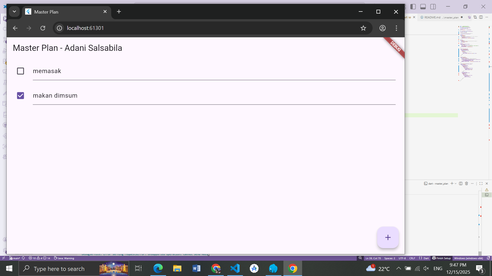

# master_plan

# PRAKTIKUM 1 : Dasar State dengan Model-View

   

1. Jelaskan maksud dari langkah 4 pada praktikum tersebut! Mengapa dilakukan demikian?
Jawaban: Langkah 4 membuat file bernama data_layer.dart yang isinya hanya mengekspor (export) model plan.dart dan task.dart. Teknik ini dikenal dengan istilah Barrel File.

Mengapa dilakukan demikian?

Efisiensi Import: Agar saat kita membutuhkan model-model tersebut di file lain (seperti di plan_screen.dart), kita cukup mengimpor satu file saja (import '../models/data_layer.dart'), tidak perlu mengimpor plan.dart dan task.dart satu per satu.

Kerapian Kode: Ini membuat bagian header file menjadi lebih bersih dan manajemen dependensi antar file menjadi lebih terstruktur, terutama jika aplikasi berkembang dan memiliki puluhan model.

2. Mengapa perlu variabel plan di langkah 6 pada praktikum tersebut? Mengapa dibuat konstanta?
Jawaban: Plan plan = const Plan();

Mengapa perlu variabel plan? Variabel ini berfungsi sebagai State (status data) dari aplikasi kita. Variabel inilah yang menyimpan data daftar tugas (tasks) yang sedang aktif. Tanpa variabel ini, UI tidak memiliki data untuk ditampilkan, dan kita tidak bisa menyimpan inputan user.

Mengapa dibuat konstanta (const) pada inisialisasi awal? Objek Plan (dan Task) didesain sebagai Immutable (tidak bisa diubah isinya setelah dibuat). Atribut di dalamnya menggunakan final. Oleh karena itu, inisialisasi awalnya menggunakan const Plan() untuk membuat objek kosong yang efisien di memori.

Karena sifatnya immutable, ketika kita ingin mengubah data (misalnya menambah tugas atau mencentang checkbox), kita tidak mengedit objek plan yang lama. Sebaliknya, kita membuat objek Plan baru yang menggantikan objek lama menggunakan setState. Ini adalah pola umum dalam manajemen state Flutter untuk memastikan UI di-render ulang dengan benar.

3. Lakukan capture hasil dari Langkah 9 berupa GIF, kemudian jelaskan apa yang telah Anda buat!
(Di sini Anda harus merekam layar emulator Anda sendiri. Pastikan GIF menunjukkan Anda menekan tombol (+), mengetik teks, dan mencentang checkbox).

Penjelasan yang bisa Anda tulis: Pada langkah ini, saya telah berhasil membuat antarmuka utama aplikasi Master Plan.

Fitur: Aplikasi dapat menampilkan daftar tugas (ListView), tombol tambah tugas (FloatingActionButton), dan setiap tugas memiliki Checkbox serta TextFormField untuk input teks.

Mekanisme:

Saat tombol (+) ditekan, sebuah objek Task baru ditambahkan ke dalam list, dan setState dipanggil untuk memperbarui tampilan.

Saat teks diketik atau checkbox dicentang, aplikasi membuat salinan baru dari objek Plan dan Task dengan data yang diperbarui, lalu me-render ulang layar agar perubahan terlihat secara real-time.

4. Apa kegunaan method pada Langkah 11 dan 13 dalam lifecycle state?
Jawaban:

Langkah 11: initState()

Kegunaan: Method ini adalah bagian dari lifecycle StatefulWidget yang dipanggil hanya satu kali ketika widget pertama kali disisipkan ke dalam widget tree.

Dalam Praktikum ini: Digunakan untuk menginisialisasi ScrollController dan menambahkan listener. Listener ini berfungsi untuk mendeteksi scroll, sehingga ketika pengguna menggulir layar, keyboard akan otomatis tertutup (fokus dilepas) agar tidak menutupi daftar tugas.

Langkah 13: dispose()

Kegunaan: Method ini dipanggil ketika widget tersebut dihapus secara permanen dari widget tree (misalnya pindah halaman atau aplikasi ditutup).

Dalam Praktikum ini: Digunakan untuk memanggil scrollController.dispose(). Ini sangat penting untuk mencegah Memory Leak (kebocoran memori). Karena ScrollController memegang referensi ke sumber daya sistem, kita wajib membersihkannya secara manual saat tidak lagi digunakan agar performa aplikasi tetap terjaga.

# PRAKTIKUM 2: Mengelola Data Layer dengan InheritedWidget dan InheritedNotifier    

