# async_lab

# PRAKTIKUM 1 : Mengunduh Data dari Web Service (API)

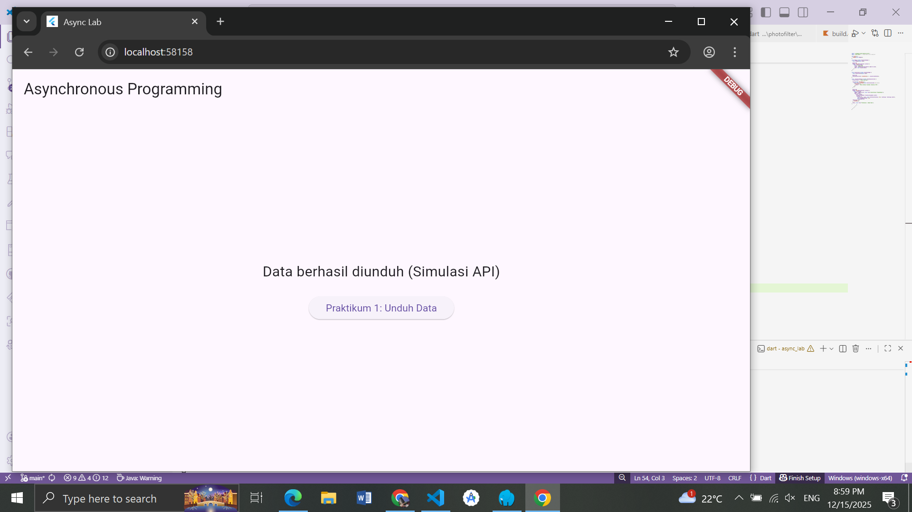   

# PRAKTIKUM 2 : Menggunakan await/async untuk menghindari callbacks

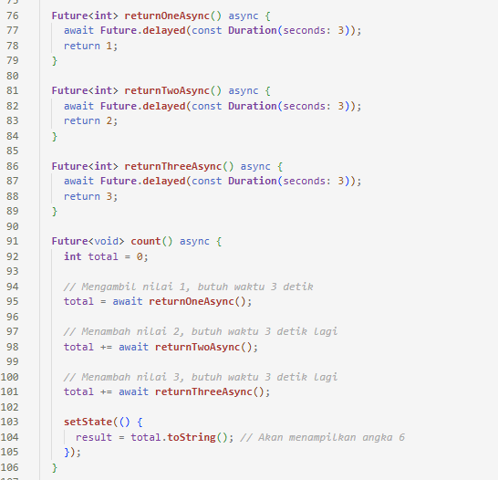      

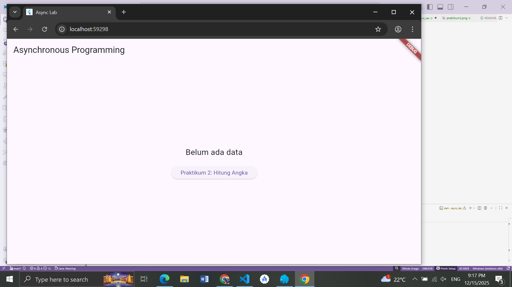      

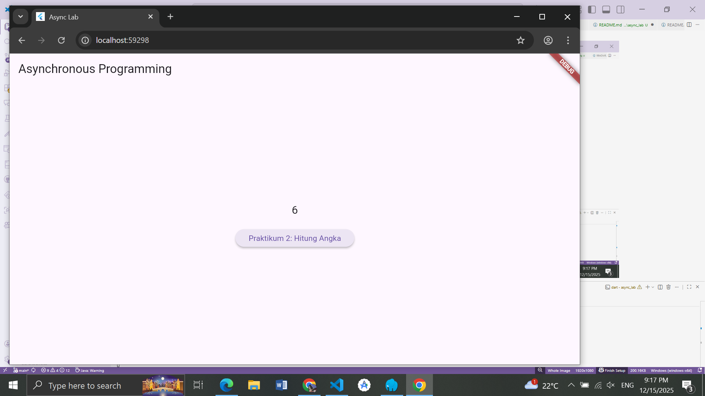      

Jawaban Soal 4
Pertanyaan: Jelaskan maksud kode langkah 1 dan 2 tersebut!

Jawaban:

Langkah 1 (Deklarasi Method Async): Kita membuat tiga fungsi (returnOneAsync, returnTwoAsync, returnThreeAsync) yang bertipe Future<int>. Setiap fungsi memiliki jeda waktu (delay) selama 3 detik sebelum mengembalikan nilai integer (1, 2, dan 3). Kata kunci async menandakan bahwa fungsi ini bersifat asynchronous, dan await Future.delayed memastikan fungsi menunggu waktunya habis sebelum lanjut mengembalikan nilai.

Langkah 2 (Eksekusi Sequential dengan await): Pada method count(), kita menjumlahkan hasil dari ketiga fungsi tersebut. Poin kuncinya adalah penggunaan kata kunci await pada setiap pemanggilan fungsi.

Ketika await returnOneAsync() dipanggil, kode berhenti menunggu selama 3 detik sampai angka 1 didapat.

Baru setelah itu, await returnTwoAsync() dijalankan (menunggu 3 detik lagi).

Terakhir await returnThreeAsync() dijalankan (menunggu 3 detik lagi).

Karena dijalankan secara berurutan (tunggu satu selesai, baru lanjut ke berikutnya), total waktu yang dibutuhkan adalah 3 + 3 + 3 = 9 detik. Hasil akhirnya adalah 1 + 2 + 3 = 6. Kode ini ditulis seperti kode synchronous biasa (mudah dibaca dari atas ke bawah) namun berjalan secara asynchronous.

# PRAKTIKUM 3 : Menggunakan Completer di Future    

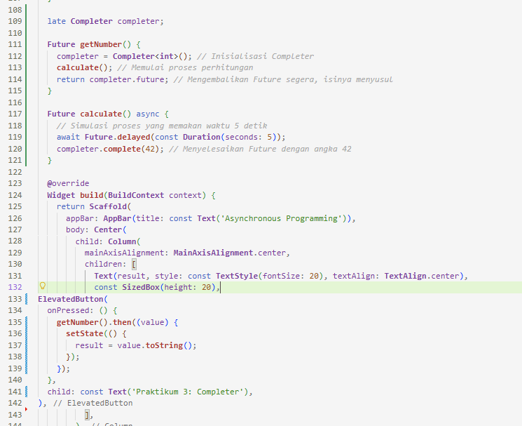      

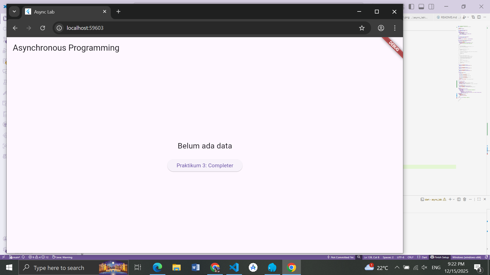      

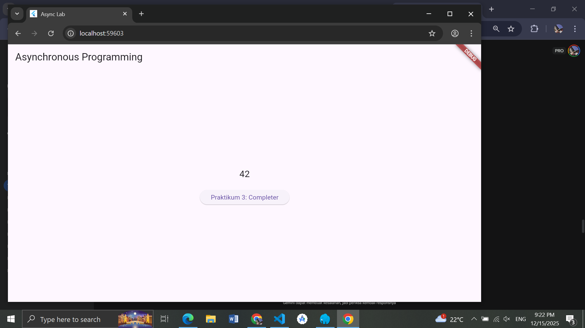      

Jawaban Soal 5
Pertanyaan: Jelaskan maksud kode langkah 2 tersebut!

Jawaban: Kode pada langkah 2 bertujuan untuk membuat mekanisme Future secara manual menggunakan Completer.

completer = Completer<int>();: Kita membuat object Completer baru yang nantinya akan menghasilkan nilai bertipe int.

return completer.future;: Pada method getNumber, kita tidak menunggu proses selesai. Kita langsung mengembalikan object Future dari completer tersebut. Ini seperti memberikan "janji" (tiket) kepada pemanggil bahwa nanti akan ada data.

calculate() & completer.complete(42): Method calculate berjalan secara asynchronous (menunggu 5 detik). Setelah waktu habis, kita memanggil completer.complete(42). Perintah ini memberitahu Completer bahwa tugas sudah selesai dan "janji" tadi dipenuhi dengan nilai 42. Saat baris ini dieksekusi, bagian .then() di tombol akan berjalan.

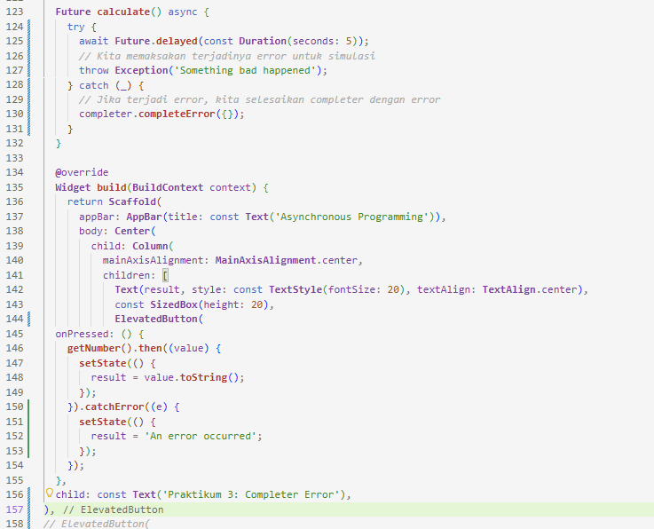      

      

Jawaban Soal 6
Pertanyaan: Jelaskan maksud perbedaan kode langkah 2 dengan langkah 5-6 tersebut!

Jawaban:

Langkah 2 (Sukses): Kode ini berasumsi proses selalu berhasil. Method calculate() menggunakan completer.complete(42) untuk mengirimkan data sukses. Di bagian pemanggil (Langkah 3), kita hanya menggunakan .then() untuk menangkap data sukses tersebut.

Langkah 5-6 (Error Handling):

Pada Langkah 5, kita mensimulasikan kegagalan proses (menggunakan try-catch dan throw Exception). Alih-alih complete(), kita menggunakan completer.completeError({}). Ini memberitahu Future bahwa tugas gagal.

Pada Langkah 6, kita menambahkan blok .catchError(...) setelah .then(). Ini berfungsi untuk "menangkap" jika completer mengirimkan status error. Jika kita tidak menambahkan catchError, aplikasi bisa crash (Uncaught Exception) saat completer.completeError dipanggil.

# PRAKTIKUM 4: Memanggil Future secara paralel

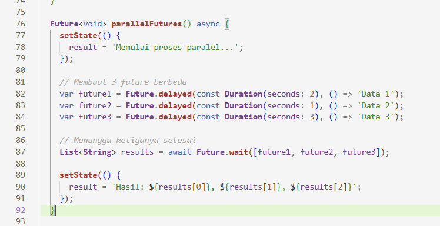      

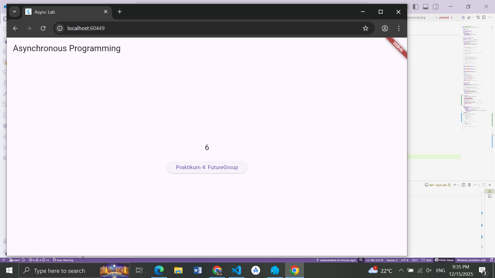      

Jawaban Soal 8
Pertanyaan: Jelaskan maksud perbedaan kode langkah 1 dan 4!

Jawaban:

Langkah 1 (FutureGroup): Menggunakan FutureGroup dari package async. Class ini lebih fleksibel jika kita memiliki skenario yang kompleks di mana jumlah future yang ingin dijalankan belum diketahui di awal. Kita bisa menggunakan .add() berulang kali di berbagai bagian kode logika, dan baru memanggil .close() saat kita yakin semua future sudah ditambahkan. Ini berguna untuk kasus dynamic batch processing.

Langkah 4 (Future.wait): Menggunakan Future.wait yang merupakan bawaan dari Dart (dart:async). Ini adalah cara yang lebih bersih, ringkas, dan standar untuk menangani kumpulan future yang sudah fix (tetap) dan diketahui jumlahnya sejak awal. Kita langsung memasukkan List future ke dalam konstruktor. Kode menjadi lebih pendek karena tidak perlu inisialisasi group, add manual, dan close manual. Untuk kasus praktikum ini (hanya 3 fungsi tetap), Future.wait sebenarnya lebih efisien secara penulisan kode.

# PRAKTIKUM 5: Menangani Respon Error pada Async Code

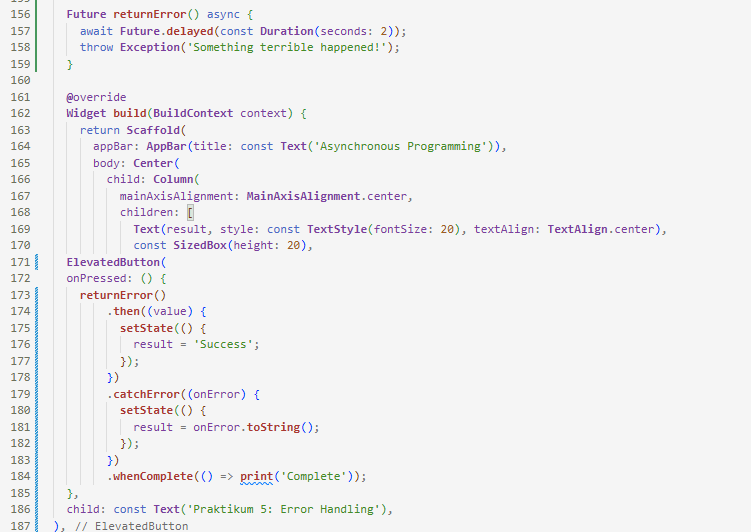      

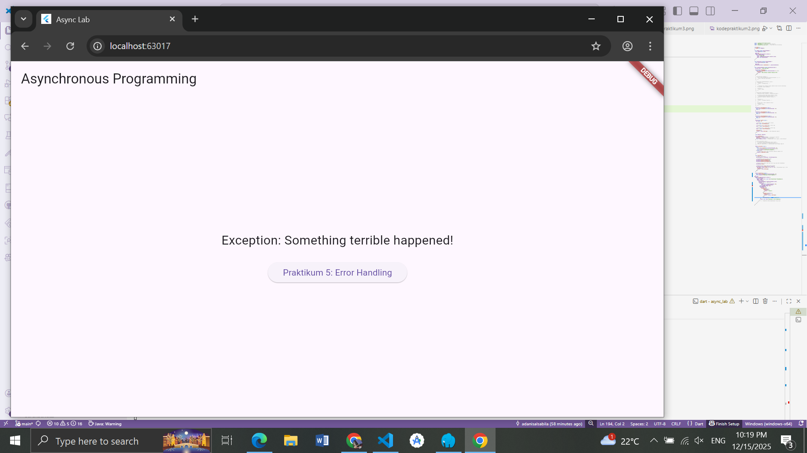      

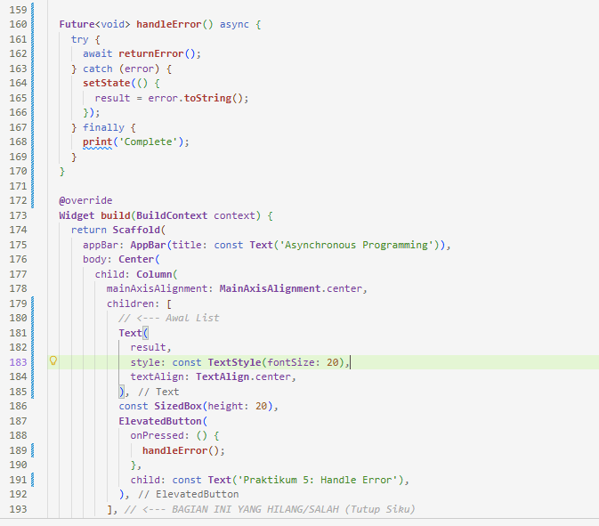      

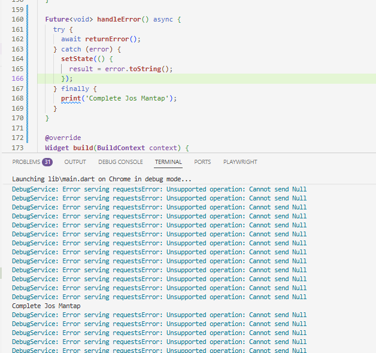      

Pertanyaan: Jelaskan perbedaan kode langkah 1 dan 4!

Jawaban:

Langkah 1 (Pola then/catchError): Menggunakan pendekatan callback-based. Kita merangkai fungsi-fungsi yang akan dijalankan setelah Future selesai.

.then() menangani kondisi sukses.

.catchError() menangani kondisi error (mirip blok catch).

.whenComplete() dijalankan apapun yang terjadi (mirip blok finally). Kode ini lebih bersifat fungsional, tetapi bisa menjadi sulit dibaca jika rantainya terlalu panjang (callback hell).

Langkah 4 (Pola async/await dengan try-catch): Menggunakan pendekatan imperative yang terlihat seperti kode synchronous biasa.

Kita "menunggu" (await) proses returnError() selesai.

Jika terjadi error selama await, eksekusi langsung lompat ke blok catch.

Blok finally akan selalu dieksekusi di akhir.

Pola ini umumnya lebih disukai (cleaner) di Flutter karena alur kodenya lebih mudah dipahami dan dibaca dari atas ke bawah.

# PRAKTIKUM 6 : Menggunakan Future dengan StatefulWidget    

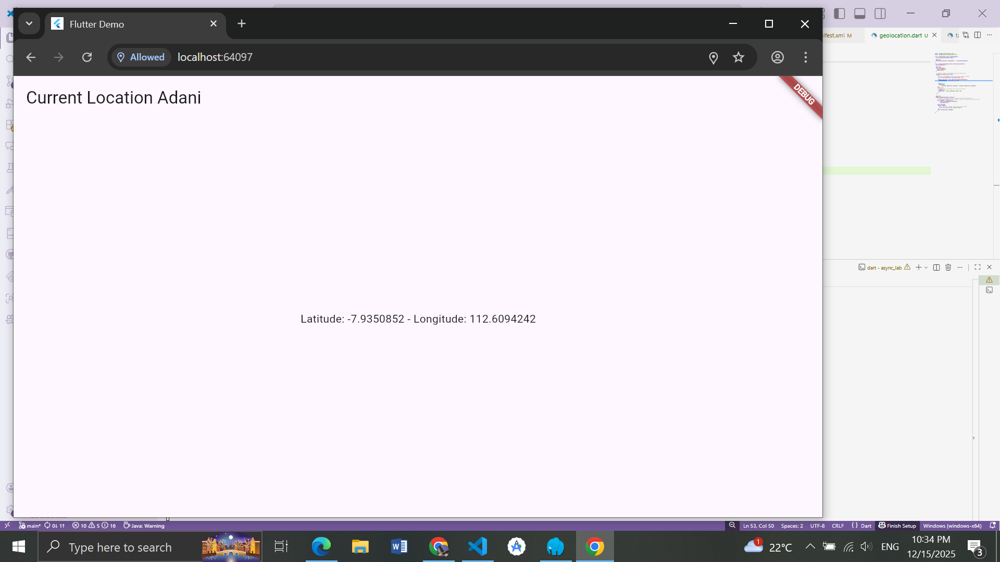      

Pertanyaan: Apakah Anda mendapatkan koordinat GPS ketika run di browser? Mengapa demikian?

Jawaban: Ya, koordinat GPS tetap bisa didapatkan di browser (Flutter Web). Mengapa? Karena package geolocator mendukung platform Web. Di belakang layar, ia menggunakan HTML5 Geolocation API standar yang ada di browser modern.

# PRAKTIKUM 7 : Manajemen Future dengan FutureBuilder

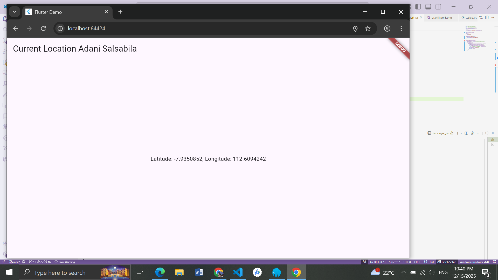      

Pertanyaan: Apakah ada perbedaan UI dengan praktikum sebelumnya? Mengapa demikian?

Jawaban untuk Laporan:

Secara Visual (UI): Tidak ada perbedaan. Tampilannya sama persis: muncul loading spinner selama 3 detik, lalu muncul teks koordinat lokasi.

Secara Teknis (Logic): Ada perbedaan besar.

Pada praktikum sebelumnya (Praktikum 6), kita memaksa UI berubah secara manual menggunakan setState().

Pada praktikum ini (Praktikum 7), kita tidak lagi memanggil setState(). Widget FutureBuilder secara otomatis mendengarkan status dari future (waiting, done). Ketika status berubah (misal dari loading ke selesai), FutureBuilder otomatis membangun ulang (rebuild) widget di dalamnya. Ini membuat kode lebih bersih (clean code) dan reaktif.

# PRAKTIKUM 8 : Navigation route dengan Future Function     

      

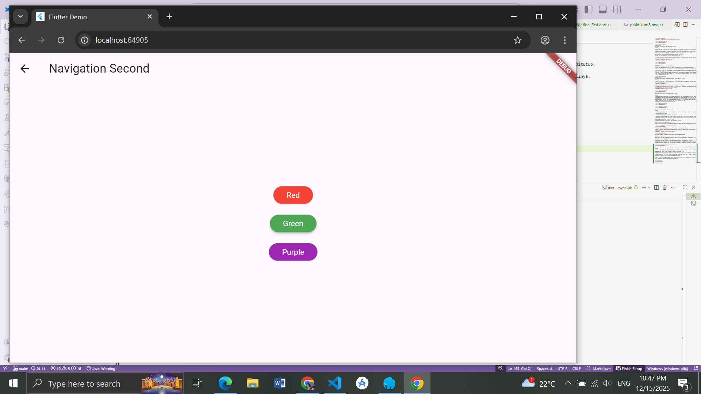      

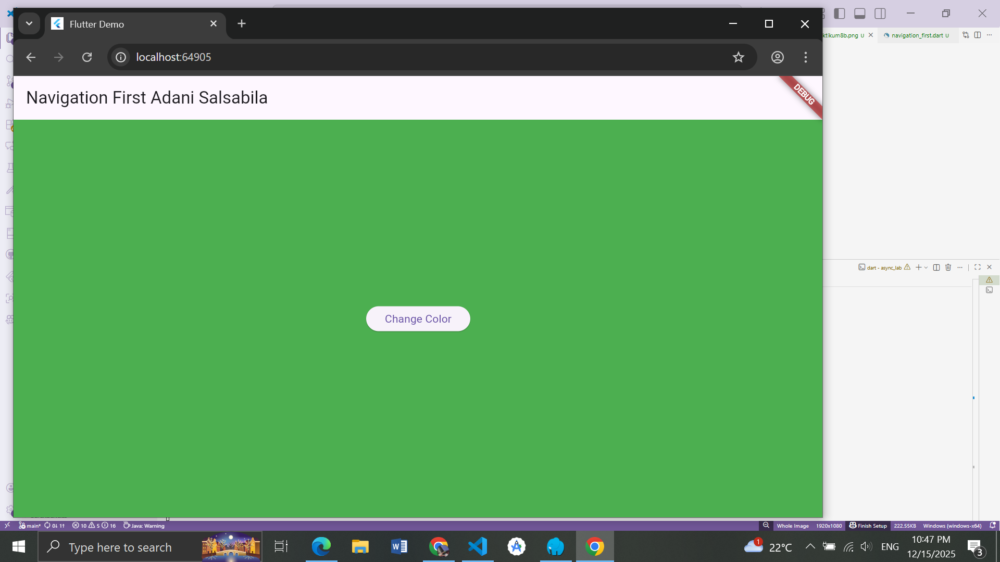      

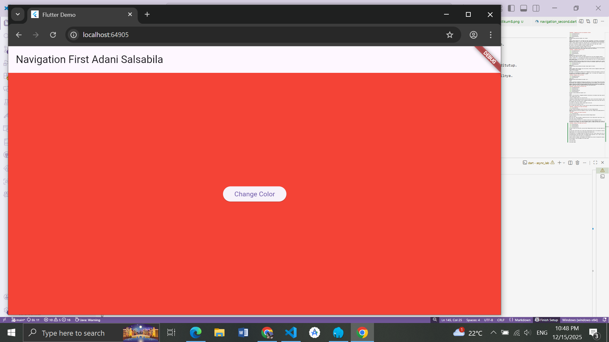      

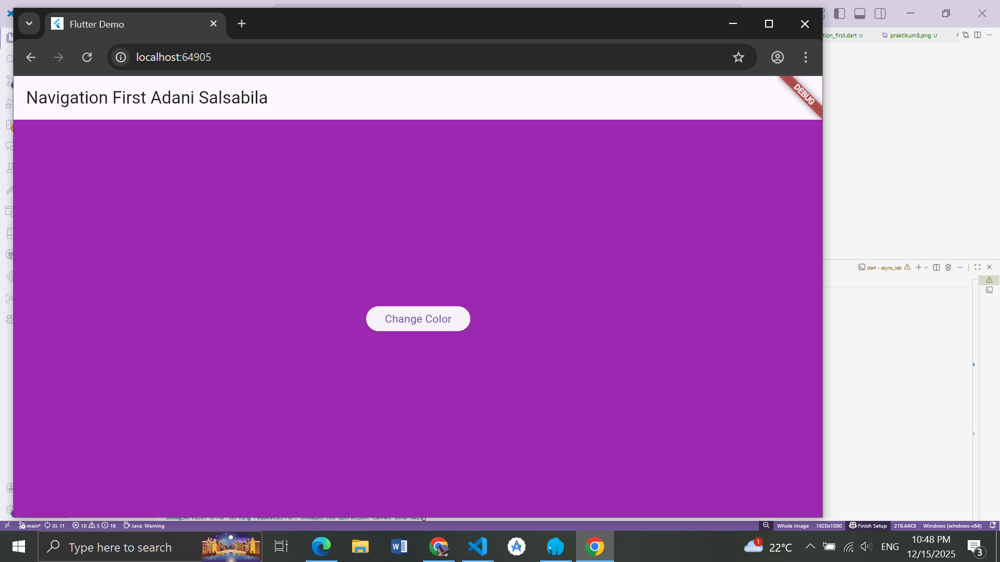      

Pertanyaan: Cobalah klik setiap button, apa yang terjadi? Mengapa demikian? Gantilah 3 warna pada langkah 5 dengan warna favorit Anda!

Jawaban:

Apa yang terjadi: Ketika tombol warna di halaman kedua (NavigationSecond) diklik, warna background di halaman pertama (NavigationFirst) berubah sesuai dengan warna tombol yang ditekan.

Mengapa demikian: Hal ini terjadi karena konsep Navigation Route dengan Future:

Pada NavigationFirst, kita memanggil Navigator.push dengan kata kunci await. Artinya, eksekusi kode di baris tersebut akan "berhenti sementara" (pause) menunggu sampai halaman kedua ditutup.

Pada NavigationSecond, ketika tombol ditekan, kita memanggil Navigator.pop(context, color). Fungsi ini menutup halaman kedua sekaligus mengirimkan data objek color kembali ke pemanggilnya.

Data warna tersebut diterima oleh variabel color di NavigationFirst.

Kemudian setState({}) dipanggil, yang menyebabkan Flutter membangun ulang (rebuild) UI NavigationFirst dengan warna latar belakang yang baru.

Warna yang diganti: Saya telah mengganti warna tombol menjadi:

Colors.red (Merah)

Colors.green (Hijau)

Colors.purple (Ungu)

# PRAKTIKUM 9 : Memanfaatkan async/await dengan Widget Dialog     

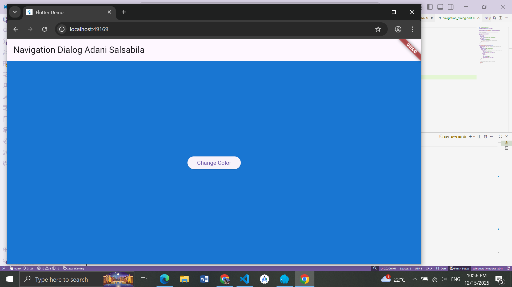      

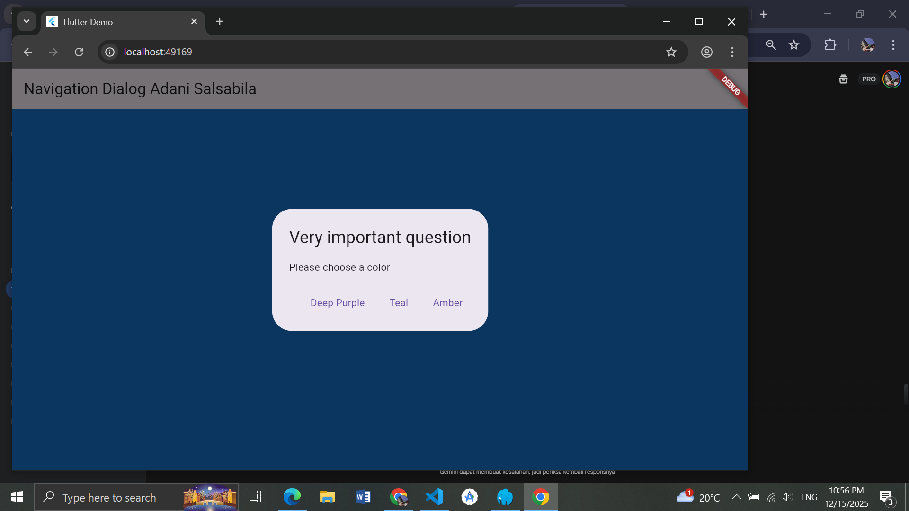      

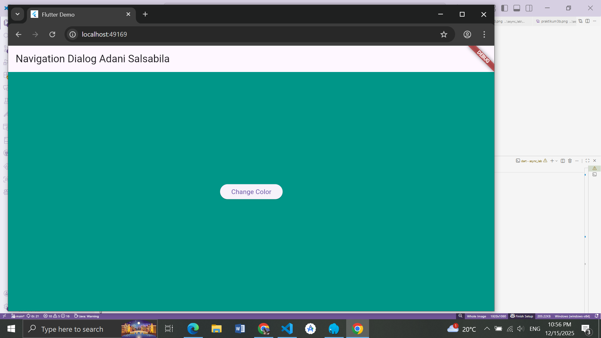     

Pertanyaan: Cobalah klik setiap button, apa yang terjadi? Mengapa demikian? Gantilah 3 warna pada langkah 3 dengan warna favorit Anda!

Jawaban:

Apa yang terjadi: Ketika tombol di dalam dialog diklik, dialog akan tertutup dan warna latar belakang layar utama akan berubah sesuai dengan tombol warna yang dipilih.

Mengapa demikian:

Fungsi showDialog di Flutter adalah fungsi asynchronous yang mengembalikan sebuah Future.

Kita menggunakan kata kunci await di depan showDialog. Ini memberitahu program untuk "menunggu" di baris tersebut sampai dialog ditutup.

Ketika tombol di dalam dialog ditekan, kita memanggil Navigator.pop(context, warna). Fungsi ini menutup dialog dan mengirimkan data warna kembali ke pemanggilnya (showDialog).

Setelah dialog tertutup, nilai Future terpenuhi, variabel selectedColor menerima data warna tersebut.

Terakhir, setState dijalankan untuk memperbarui UI dengan warna baru.

Warna Favorit yang Diganti: Saya telah mengganti warna di kode langkah 3 menjadi:

Colors.deepPurple (Ungu Tua)

Colors.teal (Hijau Kebiruan)

Colors.amber (Kuning Amber)