# stream_adani

# PRAKTIKUM 1 : Dart Streams         

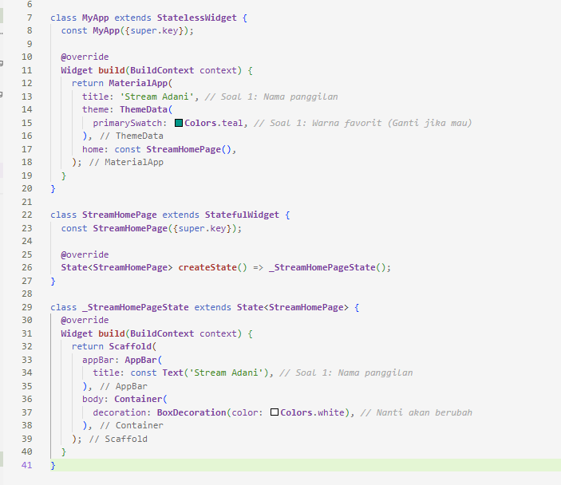      

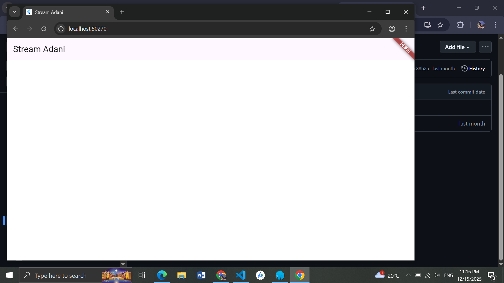      

-- menambahkan stream.dart

      

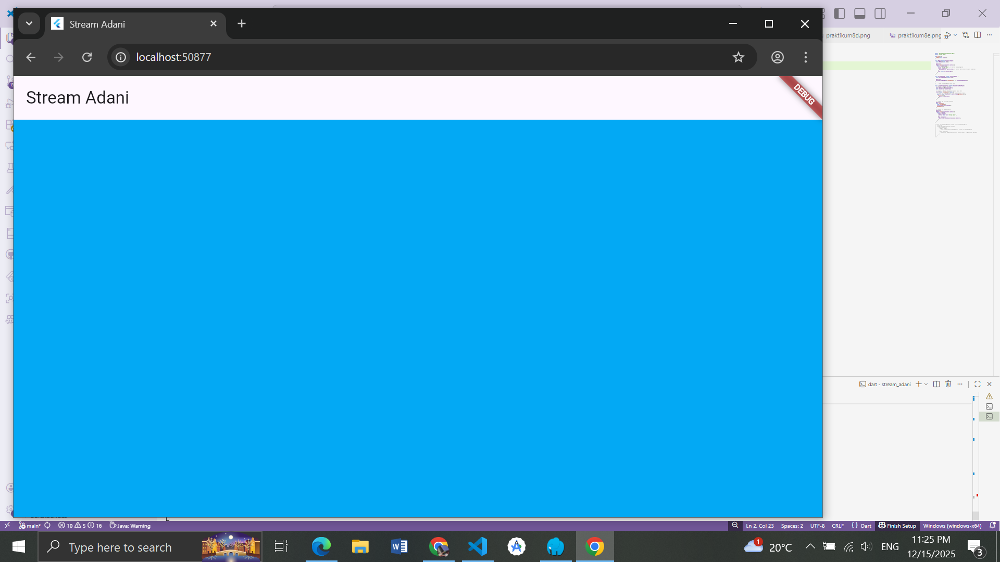      

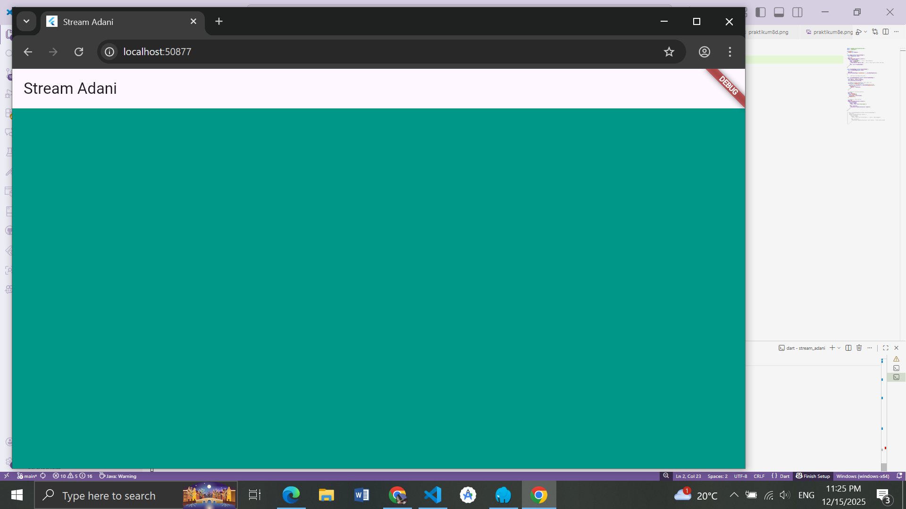      

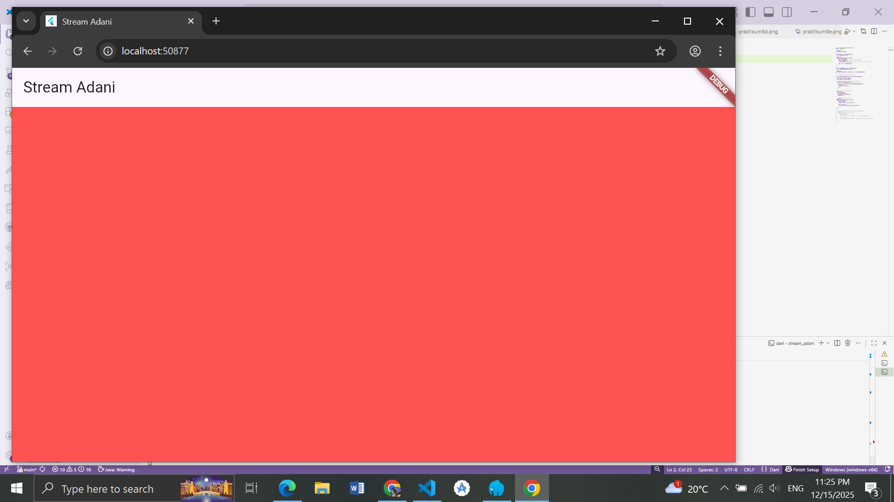      

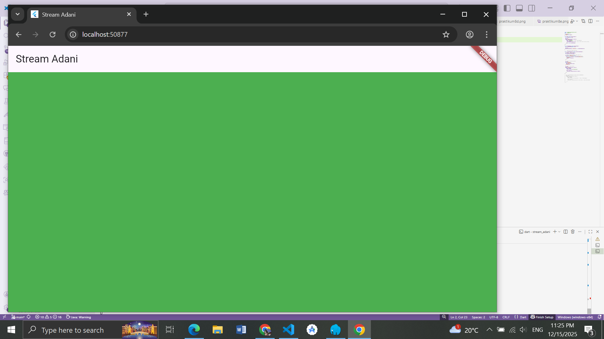      

Jawaban Soal 3 :

Fungsi keyword yield*: Keyword ini digunakan untuk mendelegasikan (mengoper) pembuatan nilai ke Stream lain (sub-stream). Dalam konteks ini, getColors mengambil seluruh event yang dihasilkan oleh Stream.periodic dan meneruskannya keluar seolah-olah getColors sendiri yang menghasilkannya.

Maksud perintah kode tersebut: Kode Stream.periodic membuat stream yang memancarkan event setiap 1 detik. Parameter (int t) adalah hitungan detik yang berjalan (0, 1, 2, ...). Rumus t % colors.length digunakan untuk mendapatkan index warna secara berulang (looping) agar tidak index out of bounds.

Jawaban Soal 5 : Perbedaan listen dan await for:

await for: Ini adalah konstruksi looping yang digunakan di dalam fungsi async. Ia akan menunggu (memblokir eksekusi baris kode di bawahnya dalam fungsi tersebut) sampai stream selesai atau ditutup. Ini cocok jika kita ingin memproses stream secara berurutan dalam satu alur fungsi.

listen: Ini adalah metode standar untuk men-subscribe sebuah stream. Ia tidak memblokir eksekusi kode selanjutnya. listen mendaftarkan sebuah callback function yang akan dipanggil setiap kali ada data baru. Ia mengembalikan objek StreamSubscription yang bisa digunakan untuk mengontrol stream (pause, resume, cancel).

# PRAKTIKUM 2 : Stream controllers dan sinks            

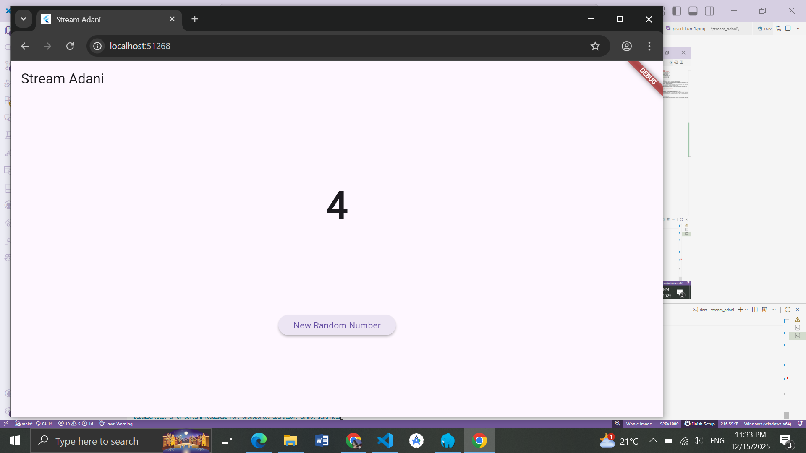      

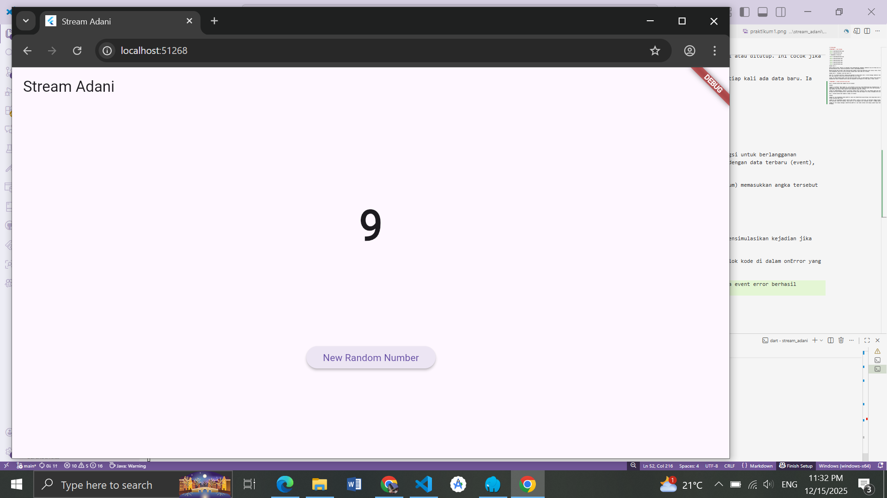    

Soal 6: Jelaskan maksud kode langkah 8 dan 10 tersebut!

Jawaban:

Langkah 8 (initState): Pada langkah ini, kita melakukan inisialisasi objek NumberStream dan StreamController. Bagian terpenting adalah stream.listen((event) { ... }). Kode ini berfungsi untuk berlangganan (subscribe) ke stream. Setiap kali ada data baru yang masuk ke stream, fungsi di dalam listen akan dijalankan. Di sini, kita memanggil setState untuk memperbarui variabel lastNumber dengan data terbaru (event), yang kemudian akan memicu rebuild pada UI untuk menampilkan angka baru tersebut.

Langkah 10 (addRandomNumber): Method ini berfungsi sebagai pemicu (producer) data. Kita membuat angka acak (0-9) menggunakan Random(). Kemudian, kode numberStream.addNumberToSink(myNum) memasukkan angka tersebut ke dalam Sink milik StreamController. Setelah masuk ke Sink, data akan mengalir ke Stream, ditangkap oleh listener (di langkah 8), dan akhirnya muncul di layar.

Soal 7: Jelaskan maksud kode langkah 13 sampai 15 tersebut!

Jawaban:

Langkah 13: Kita menambahkan method addError() pada class NumberStream yang berfungsi untuk mengirimkan event Error ke dalam sink menggunakan controller.sink.addError('error'). Ini mensimulasikan kejadian jika terjadi kesalahan pada stream.

Langkah 14: Kita menambahkan properti onError pada method .listen() di main.dart. Ini berfungsi sebagai exception handler. Jika stream menerima event error (bukan data biasa), maka blok kode di dalam onError yang akan dijalankan, bukan blok utamanya. Dalam kasus ini, kita mengubah nilai lastNumber menjadi -1 sebagai penanda error.

Langkah 15: Kita sengaja memanggil numberStream.addError() saat tombol ditekan untuk menguji apakah fungsi handling error bekerja. Hasilnya, UI menampilkan angka -1, membuktikan bahwa event error berhasil ditangkap.

# PRAKTIKUM 3 : Injeksi data ke streams

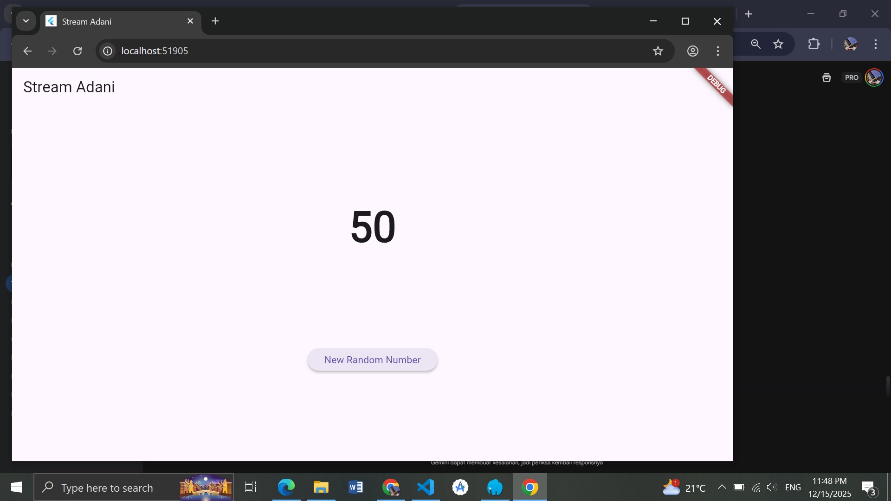      

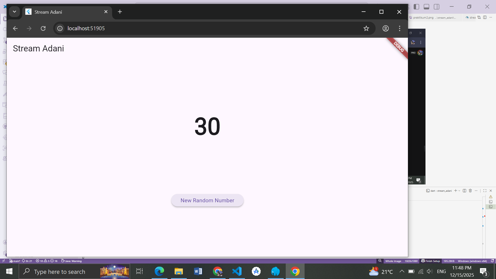       

Soal 8: Jelaskan maksud kode langkah 1-3 tersebut!

Jawaban:

Langkah 1: Kita mendeklarasikan variabel transformer bertipe StreamTransformer. Ini adalah objek yang akan digunakan untuk memanipulasi data stream sebelum data tersebut sampai ke listener (UI).

Langkah 2: Kita menginisialisasi transformer dengan logika pemrosesan data. Menggunakan method fromHandlers, kita mendefinisikan fungsi handleData. Di sinilah manipulasi terjadi: setiap data integer (value) yang masuk akan dikalikan dengan 10 (value * 10) sebelum diteruskan kembali ke sink (sink.add). Jadi, jika inputnya 5, outputnya menjadi 50.

Langkah 3: Kita menerapkan transformer tersebut ke stream utama menggunakan perintah .transform(transformer). Ini seperti menyambungkan pipa filter. Alur datanya menjadi: StreamController (Input) -> Transformer (Dikali 10) -> Listen (Update UI). Hasilnya, data yang diterima oleh listen dan ditampilkan di layar adalah data yang sudah dimodifikasi (0-90), bukan data mentah (0-9).

 
# PRAKTIKUM 4 : Subscribe ke stream events      

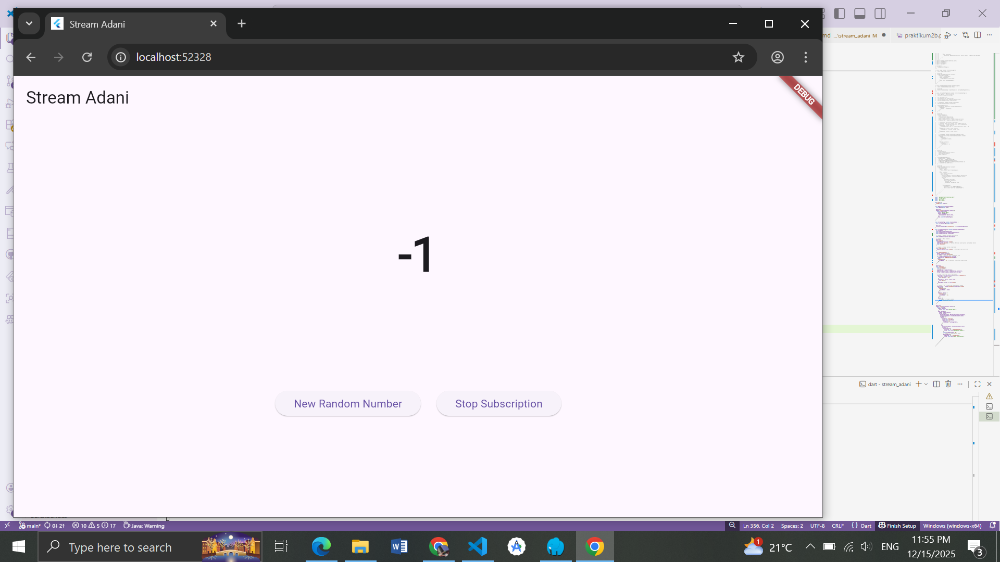      

Soal 9: Jelaskan maksud kode langkah 2, 6, dan 8 tersebut!

Jawaban:

Langkah 2 (initState & Listen): Pada langkah ini, kita melakukan inisialisasi stream dan transformer, lalu melakukan subscription (berlangganan) ke stream tersebut. Hasil langganan ini disimpan dalam variabel subscription. Bedanya dengan praktikum sebelumnya, di sini kita mendefinisikan handler yang lengkap:

Handler utama (untuk data sukses).

onError (untuk menangani jika ada error).

onDone (untuk menangani ketika stream ditutup/selesai). Ini memungkinkan kita untuk merespons semua status stream dengan baik.

Langkah 6 (dispose): Method dispose() dipanggil oleh Flutter ketika widget ini dihapus dari widget tree (misalnya pindah layar atau aplikasi ditutup). Di sini kita memanggil subscription.cancel(). Ini adalah praktik terbaik (best practice) untuk mencegah Memory Leak. Jika kita tidak membatalkan subscription, stream akan terus mendengarkan di latar belakang meskipun UI-nya sudah tidak ada, yang bisa membebani kinerja aplikasi.

Langkah 8 (addRandomNumber): Method ini bertugas membuat angka acak (0-9) dan memasukkannya ke dalam stream menggunakan addNumberToSink. Ini adalah sisi Producer dari stream. Data yang dimasukkan di sini akan diproses oleh transformer (dikali 10) dan kemudian diterima oleh listener di langkah 2 untuk memperbarui UI. (Catatan tambahan: Sebaiknya kita juga mengecek apakah controller sudah ditutup atau belum sebelum menambah data agar tidak terjadi error unhandled exception).

# PRAKTIKUM 5 : Multiple stream subscriptions

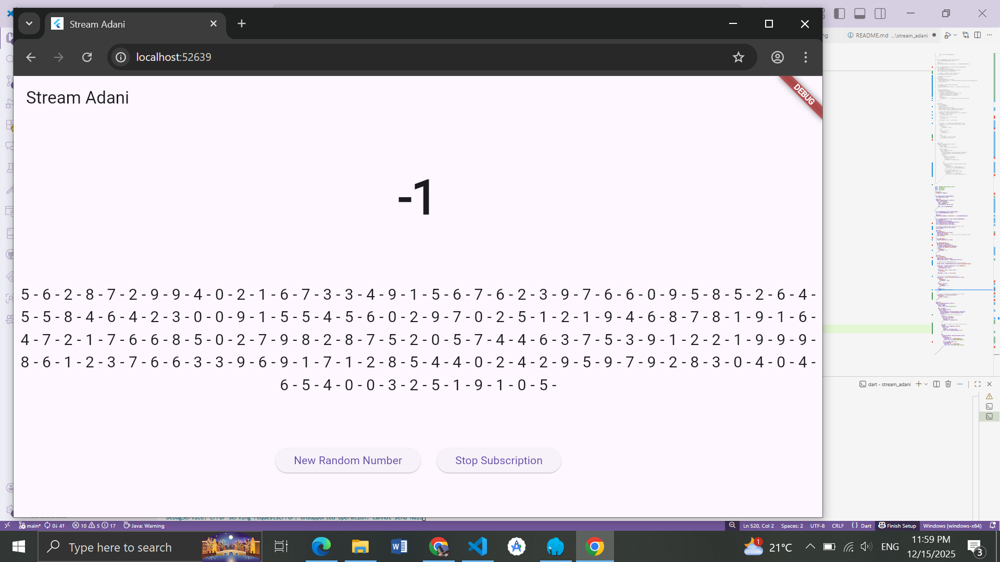      

Soal 10: Jelaskan mengapa error itu bisa terjadi?

Jawaban: Error tersebut (Bad state: Stream has already been listened to) terjadi karena secara default, Stream di Dart bersifat Single-Subscription. Artinya, stream tersebut hanya boleh memiliki satu pendengar (listener) pada satu waktu. Pada langkah 2, kita mencoba melakukan .listen() kembali pada variabel stream yang sama yang sudah didengarkan oleh subscription pertama. Karena stream tersebut belum diubah menjadi broadcast stream, maka Dart menolak permintaan subscription kedua dan melemparkan error.

Soal 11: Jelaskan mengapa hal itu bisa terjadi?

Jawaban: Hal itu terjadi karena kita telah mengubah stream menjadi Broadcast Stream menggunakan method .asBroadcastStream().

Broadcast Stream memungkinkan banyak listener (subscriber) untuk mendengarkan stream yang sama secara bersamaan.

Ketika tombol ditekan dan sebuah angka dimasukkan ke sink, stream akan "menyiarkan" angka tersebut ke semua subscriber yang aktif.

Akibatnya:

Subscription 1 menerima data, lalu mengubahnya lewat transformer (dikali 10), dan memperbarui tampilan angka besar (lastNumber).

Subscription 2 menerima data (data mentah tanpa transformer karena kita listen langsung ke stream), lalu menambahkannya ke variabel string values (misal: 4 - ).

