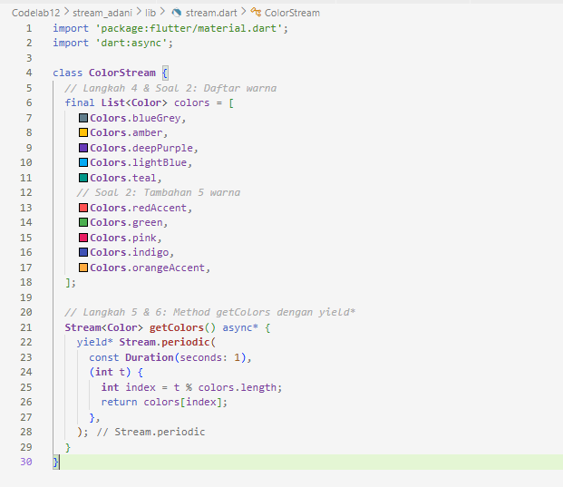

# stream_adani

# PRAKTIKUM 1 : Dart Streams         

      

      

-- menambahkan stream.dart

      

      

      

      

      

Jawaban Soal 3 :

Fungsi keyword yield*: Keyword ini digunakan untuk mendelegasikan (mengoper) pembuatan nilai ke Stream lain (sub-stream). Dalam konteks ini, getColors mengambil seluruh event yang dihasilkan oleh Stream.periodic dan meneruskannya keluar seolah-olah getColors sendiri yang menghasilkannya.

Maksud perintah kode tersebut: Kode Stream.periodic membuat stream yang memancarkan event setiap 1 detik. Parameter (int t) adalah hitungan detik yang berjalan (0, 1, 2, ...). Rumus t % colors.length digunakan untuk mendapatkan index warna secara berulang (looping) agar tidak index out of bounds.

Jawaban Soal 5 : Perbedaan listen dan await for:

await for: Ini adalah konstruksi looping yang digunakan di dalam fungsi async. Ia akan menunggu (memblokir eksekusi baris kode di bawahnya dalam fungsi tersebut) sampai stream selesai atau ditutup. Ini cocok jika kita ingin memproses stream secara berurutan dalam satu alur fungsi.

listen: Ini adalah metode standar untuk men-subscribe sebuah stream. Ia tidak memblokir eksekusi kode selanjutnya. listen mendaftarkan sebuah callback function yang akan dipanggil setiap kali ada data baru. Ia mengembalikan objek StreamSubscription yang bisa digunakan untuk mengontrol stream (pause, resume, cancel).

 