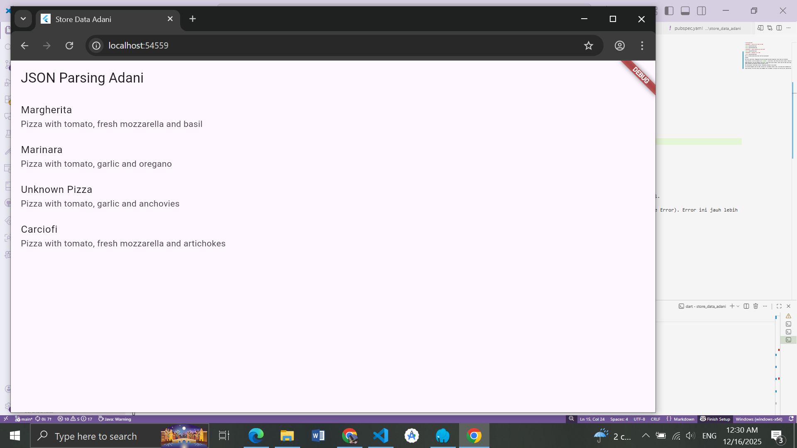
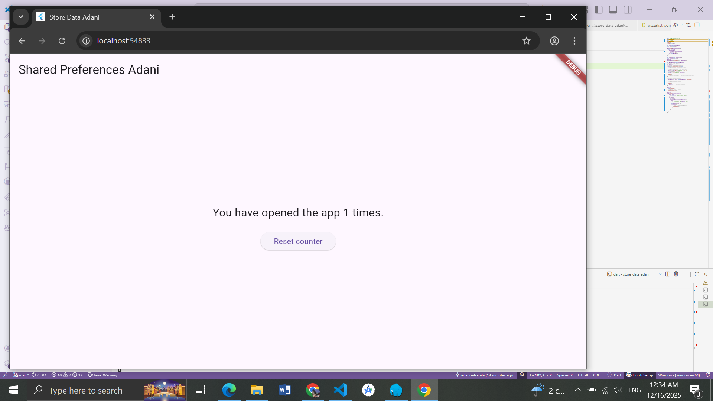

# store_data_adani

# PRAKTIKUM 1 : Konversi Dart model ke JSON    

      

       

# PRAKTIKUM 2 : Handle kompatibilitas data JSON      

      
 
# PRAKTIKUM 3 : Menangani error JSON      

      

Soal 5: Jelaskan maksud kode lebih safe dan maintainable!

Jawaban:

More Safe (Lebih Aman): Menggunakan konstanta mencegah kesalahan pengetikan (typo) yang sulit dideteksi.

Tanpa Konstanta: Jika kita mengetik json['pizaaName'] (salah ketik), kode tetap valid secara sintaks, tetapi aplikasi akan error saat dijalankan (Runtime Error) atau data menjadi null.

Dengan Konstanta: Jika kita mengetik json[keyNme] (salah ketik nama variabel), editor kode (VS Code) akan langsung memberi garis merah dan aplikasi tidak bisa di-compile (Compile-time Error). Error ini jauh lebih mudah ditemukan dan diperbaiki sebelum aplikasi dirilis.

More Maintainable (Lebih Mudah Dirawat): Memudahkan perubahan di masa depan.

Jika backend mengganti nama key JSON, misalnya dari "pizzaName" menjadi "name", kita hanya perlu mengubah satu baris kode saja di bagian deklarasi const String keyName = 'name';.

Tanpa konstanta, kita harus mencari dan mengganti teks 'pizzaName' di seluruh file satu per satu, yang berisiko ada yang terlewat.

# PRAKTIKUM 4 : SharedPreferences     

      

