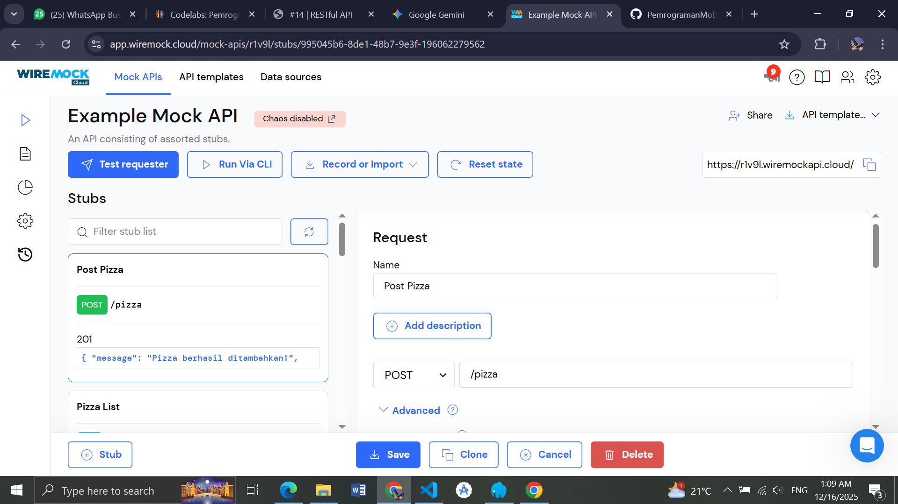
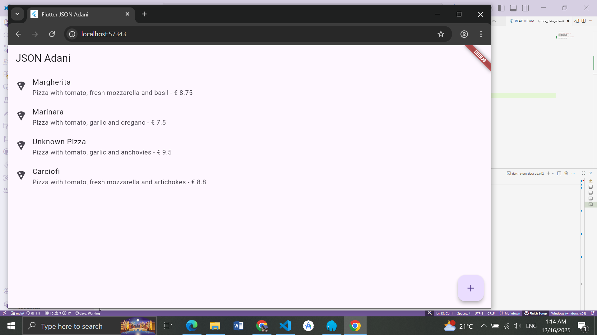
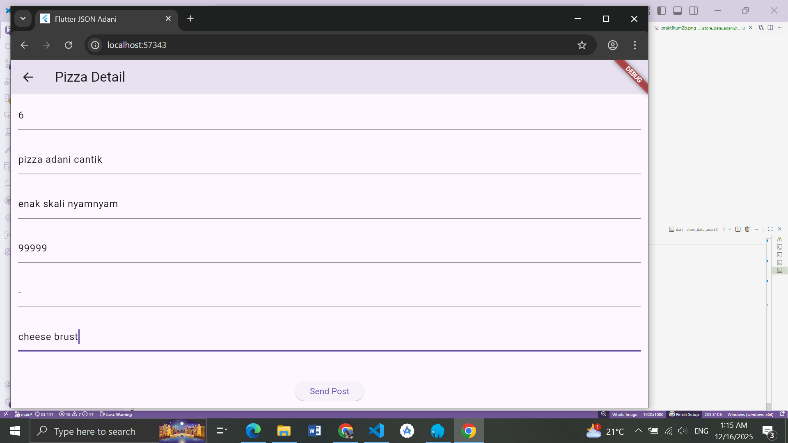
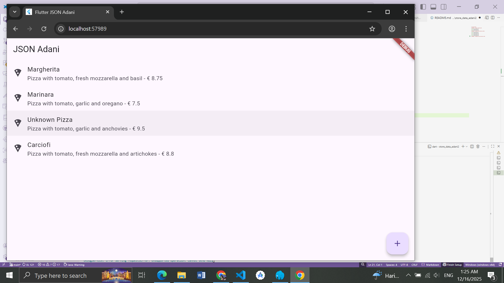
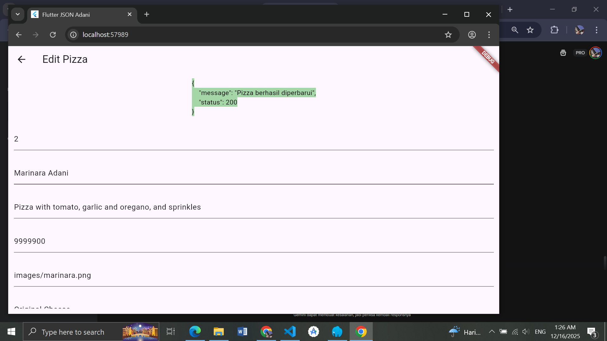
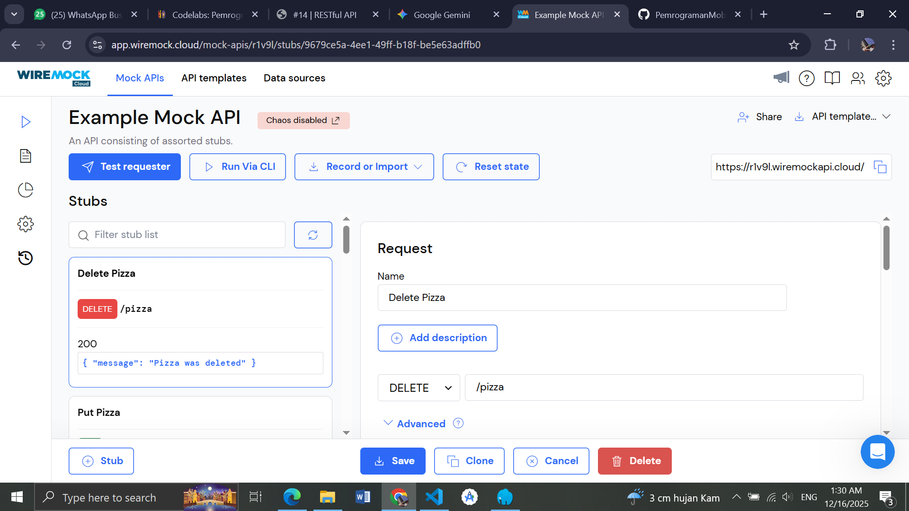
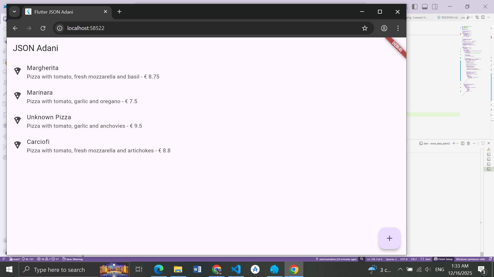
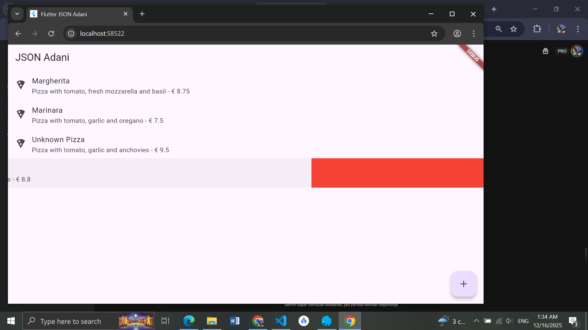
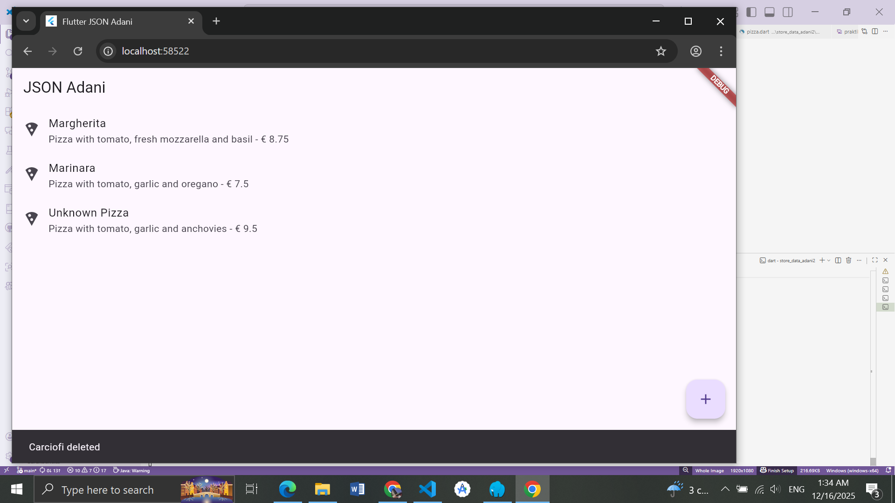

# store_data_adani2

# PRAKTIKUM 1 : Membuat layanan Mock API   

      

       

# PRAKTIKUM 2 : Mengirim Data ke Web Service (POST)    

      

      

      

      

# PRAKTIKUM 3 : Memperbarui Data di Web Service (PUT)    

      

      

      

      

# PRAKTIKUM 4 : Menghapus Data dari Web Service (DELETE)     

      

      

      

      